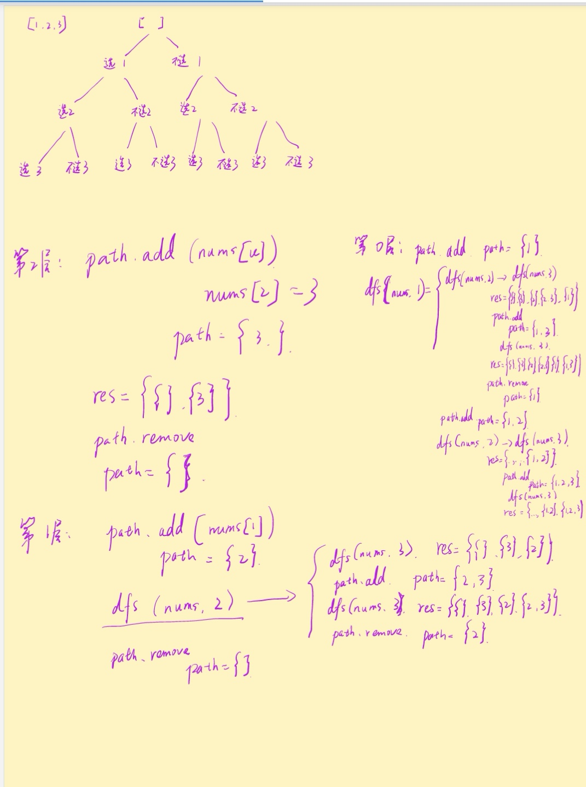
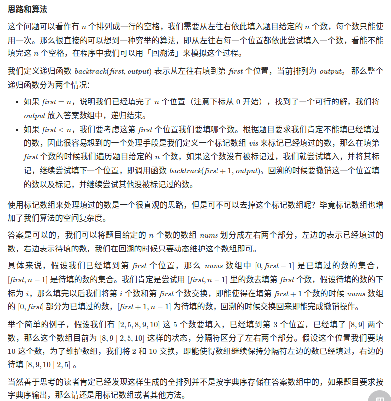

- [如何确定一道题是否应该用【爆搜】来求解](#如何确定一道题是否应该用爆搜来求解)
- [注意的点](#注意的点)
- [1. 子集 subset I](#1-子集-subset-i)
- [2. 组合总和](#2-组合总和)
- [3. 括号全排列生成](#3-括号全排列生成)
  - [3.1 纯递归](#31-纯递归)
  - [3.2 递归加回溯](#32-递归加回溯)
- [4. 全排列](#4-全排列)
- [5. 目标和](#5-目标和)
- [6. 组合总和II](#6-组合总和ii)
- [7. 子集II](#7-子集ii)
- [8. 子集 All subsets of size K](#8-子集-all-subsets-of-size-k)
- [9. 有效括号全排列 II](#9-有效括号全排列-ii)
- [10. 有效括号全排列 III](#10-有效括号全排列-iii)
- [11. 子集 all subsets of size k 有重复元素](#11-子集-all-subsets-of-size-k-有重复元素)
- [12. two subsets with min difference](#12-two-subsets-with-min-difference)
- [13. All permutations of subsets 子集全排列](#13-all-permutations-of-subsets-子集全排列)

## 如何确定一道题是否应该用【爆搜】来求解
总的来说，你可以从两个方面来考虑：

1. 求的是所有的方案，而不是方案数。 由于求的是所有方案，不可能有什么特别的优化，我们只能进行枚举。这时候可能的解法有动态规划、记忆化搜索、DFS + 回溯算法。

2. 通常数据范围不会太大，只有几十。 如果是动态规划或是记忆化搜索的题的话，由于它们的特点在于低重复/不重复枚举，所以一般数据范围可以出到 10^4到 10^5，而 DFS + 回溯的话，通常会限制在 30 以内。

## 注意的点
吞吐平衡，也就是不要让dfs的层与层之间的传递出现上一层的东西还没删干净或者上一层的状态还没有撤回的情况。

## 1. 子集 subset I

>leetcode 78

思路：中序遍历，递归
```java
class Solution {
    public List<List<Integer>> subsets(int[] nums) {
        List<List<Integer>> res = new ArrayList<>();
        List<Integer> subset = new ArrayList<>();
        int i = 0;
        res.add(subset);
        inOrder(nums, i, subset, res);
        return res;
    }
    public static void inOrder(int[] nums, int i, List<Integer> subset, List<List<Integer>> res) {
        if (i >= nums.length) return;
        subset = new ArrayList<Integer>(subset);

        inOrder(nums, i + 1, subset, res);
        subset.add(nums[i]);
        // 这里
        res.add(subset);
        inOrder(nums, i + 1, subset, res);
    }

}
```

思路2: 递归，回溯



```java
class Solution {
    List<List<Integer>> res = new ArrayList<List<Integer>>();
    List<Integer> path = new ArrayList<Integer>();
    public List<List<Integer>> subsets(int[] nums) {
        dfs(nums, 0);
        return res;
    }
    public void dfs(int[] nums, int u){
        if (u == nums.length){
            res.add(new ArrayList<Integer>(path)); // ？？
            return;
        }
        dfs(nums, u + 1);
        path.add(nums[u]);
        dfs(nums, u + 1);
        path.remove(path.size() - 1);
    }
}
```
## 2. 组合总和

>leetcode 39

```java
class Solution {
    public List<List<Integer>> combinationSum(int[] candidates, int target) {
        List<List<Integer>> res = new ArrayList<List<Integer>>();
        List<Integer> curres = new ArrayList<Integer>();
        dfs(candidates, 0, target, res, curres);
        return res;
    }
    // candidates 代表原数组
    // index 代表当前执行决策到原数组的哪一位
    // target 代表当前还差多少才能凑成
    // curres 始终表示当前结果
    // res 代表最终结果的集合
    public void dfs(int[] candidates, int index, int target, List<List<Integer>> res, List<Integer> curres){
        // 边界条件，base case，target变为0 的时候结束递归
        if (target == 0){
            res.add(new ArrayList<Integer>(curres));
            return;
        }
        // 极端情况，corner case，target小于0，即没找到组合，数组到最尾了，没满足target，结束递归
        if (index == candidates.length || target < 0){
            return;
        }
        // 枚举这一位数字所有可能的出现次数
        for (int i = 0; candidates[index]*i <= target; i++){
            dfs(candidates, index + 1, target - candidates[index]*i, res, curres);
            curres.add(candidates[index]);
        }
        // 回溯的时候，从curres的最后一个数字开始，循环删除直到该位的所有出现次数。
        for (int i = 0; candidates[index]*i <= target; i++){
            curres.remove(curres.size() - 1);
        }
    }
}
```
## 3. 括号全排列生成

>leetcode 22

### 3.1 纯递归
生成所有可能的序列，不管括号有效还是无效，那么n长度的序列就相当于n-1长度的序列后面加上左括号或者右括号，那么就一共存在2^(2n)种可能性，所有的可能性都找出来以后，边界条件判断一下序列是否有效即可。
```java
class Solution {
    public List<String> generateParenthesis(int n) {
        List<String> combinations = new ArrayList<String>();
        generateAll(new char[2 * n], 0, combinations);
        return combinations;
    }

    public void generateAll(char[] current, int pos, List<String> result) {
        if (pos == current.length) {
            if (valid(current)) {
                result.add(new String(current));
            }
        } else {
            current[pos] = '(';
            generateAll(current, pos + 1, result);// 这个为止和之前做过的一些dfs有些不同，因为两种可能性是覆盖的关系，要么左括号要么右括号，这里是走完了全部是左括号以后，回溯的时候又换右括号。
            current[pos] = ')';
            generateAll(current, pos + 1, result);
        }
    }

    public boolean valid(char[] current) {
        int balance = 0;
        for (char c: current) {
            if (c == '(') {
                ++balance;
            } else {
                --balance;
            }
            if (balance < 0) {
                return false;
            }
        }
        return balance == 0;
    }
}

```


### 3.2 递归加回溯
思路：不枚举所有有效和无效的序列，在序列失效之前回溯，保证枚举的都是有效的序列。我们可以通过跟踪到目前为止放置的左括号和右括号的数目来做到这一点。
如果左括号数量不大于 n，我们可以放一个左括号。如果右括号数量小于左括号的数量，我们可以放一个右括号。

```java
class Solution {
    public List<String> generateParenthesis(int n) {
        List<String> ans = new ArrayList<String>();
        backtrack(ans, new StringBuilder(), 0, 0, n);
        return ans;
    }

    public void backtrack(List<String> ans, StringBuilder cur, int open, int close, int max) {
        if (cur.length() == max * 2) {
            ans.add(cur.toString());
            return;
        }
        if (open < max) {
            cur.append('(');
            backtrack(ans, cur, open + 1, close, max);
            cur.deleteCharAt(cur.length() - 1); // 必须要删掉，因为用的是append，是在序列的尾端加入一个字符，所以要删掉，不然走下个分支的时候再在尾端加右括号，就不是cur这个位置了，是下个位置了。
        }
        if (close < open) {
            cur.append(')');
            backtrack(ans, cur, open, close + 1, max);
            cur.deleteCharAt(cur.length() - 1);
        }
    }
}

```
时间复杂度：纯递归就是一共有2的2n次方个可能的解，每个解都需要判断是否有效，验证每个序列的复杂度为O(n),因此总复杂度相乘。回溯算法的复杂度leetcode官方说是第n个卡特兰数，4的n次方比上根号n。

空间复杂度：取决于递归深度，O(n).

## 4. 全排列

>leetcode 46



```java
class Solution {
    public List<List<Integer>> permute(int[] nums) {
        List<List<Integer>> res = new ArrayList<List<Integer>>();

        List<Integer> output = new ArrayList<Integer>();
        for (int num : nums) {
            output.add(num);
        }

        int n = nums.length;
        backtrack(n, output, res, 0);
        return res;
    }

    public void backtrack(int n, List<Integer> output, List<List<Integer>> res, int first) {
        // 所有数都填完了
        if (first == n) {
            res.add(new ArrayList<Integer>(output));
        }
        for (int i = first; i < n; i++) {
            // 动态维护数组
            Collections.swap(output, first, i);
            // 继续递归填下一个数
            backtrack(n, output, res, first + 1);
            // 回溯，撤销操作
            Collections.swap(output, first, i);
        }
    }
}
```

## 5. 目标和

>leetcode 494

思路：和之前的题目很相似，对于数组内每个元素都决策两次，一次是正号，那就直接target减掉进入下一层，第二次是负号，那就target加上这位数进入下一层。
```java
class Solution {
    public int findTargetSumWays(int[] nums, int target) {
        List<Integer> res = new ArrayList<>();
        dfs(nums, target, 0, res);
        int sum = 0;
        for (Integer i : res){
            sum = sum + i;
        }
        return sum;
    }
    public void dfs(int[] nums, int target, int index, List<Integer> res){
        if (index == nums.length){
            if (target == 0){
                res.add(1);
            }
            return;
        }
        dfs(nums, target - nums[index], index + 1, res);
        dfs(nums, target + nums[index], index + 1, res);
    }
}
```

## 6. 组合总和II

>leetcode 40

```java
class Solution {
    public List<List<Integer>> combinationSum2(int[] cs, int t) {
        Arrays.sort(cs);
        Set<List<Integer>> ans = new HashSet<>();
        List<Integer> cur = new ArrayList<>();
        dfs(cs, t, 0, ans, cur);
        return new ArrayList<>(ans);

    }
    /**
     * cs: 原数组，从该数组进行选数
     * t: 还剩多少值需要凑成。起始值为 target ，代表还没选择任何数；当 t = 0，代表选择的数凑成了 target
     * u: 当前决策到 cs[] 中的第几位
     * ans: 最终结果集
     * cur: 当前结果集
     */
    void dfs(int[] cs, int t, int u, Set<List<Integer>> ans, List<Integer> cur) {
        if (t == 0) {
            ans.add(new ArrayList<>(cur));
            return;
        }
        if (u == cs.length || t < 0) return;

        // 使用 cs[u]
        cur.add(cs[u]);
        dfs(cs, t - cs[u], u + 1, ans, cur);

        // 进行回溯
        cur.remove(cur.size() - 1);
        // 不使用 cs[u]
        // 加一个循环，不然解法会超时，剪枝：如果不使用cs[u],那么在有序数组cs中，后续与cs[u]相等的元素也可以跳过。
        while(u+1 < cs.length && cs[u]==cs[u+1]) u++;
        dfs(cs, t, u + 1, ans, cur);
    }
}
```

## 7. 子集II

>leetcode 90

思路：在子集I 中我们只需要把这个模板稍作修改，因为有重复元素的出现，我们需要去重，这里我们依旧采用跟组合总和那里相同的hashset哈希表来储存结果集，但是｛1，2，3｝和｛1，3，2｝的哈希结果是不同的，所以还是会被当作两个不同的解被存入，所以我们先把原数组排序，这样就不会出现上述情况了，所有的解都是有序的，只要重了，哈希表就能去掉。

```java
class Solution {
    public List<List<Integer>> subsetsWithDup(int[] nums) {
        Arrays.sort(nums);
        Set<List<Integer>> res = new HashSet<>();
        List<Integer> subres = new ArrayList<>();
        dfs(nums, 0, res, subres);
        return new ArrayList<>(res);
    }
    public void dfs(int[] nums, int index, Set<List<Integer>> res, List<Integer> subres){
        if (index == nums.length){
            res.add(new ArrayList<Integer>(subres));
            return;
        }
        dfs(nums, index + 1, res, subres);
        subres.add(nums[index]);
        dfs(nums, index + 1, res, subres);
        subres.remove(subres.size() - 1);
    }
}
```

## 8. 子集 All subsets of size K 
Given a set of characters represented by a String, return a list containing all subsets of the characters whose size is K. 没有重复元素。

思路：这个很简单，就是在母题的基础上，加上一个递归的边界条件，即要在解的长度等于k的时候把解给加入到总结果集里。

```java
public class Solution {
    public List<String> subSetOfSizeK(String set, int k){
        List<String> result = new ArrayList<>();
        if (set == null){
            return result;
        }
        if (set.length() < k){
            return result;
        }
        char[] array = set.toCharArray(); // 将原string字符串转化为char数组，方便后续操作
        StringBuilder sb = new StringBuilder();
        helper(sb, 0, k, result, array);
        return result;
    }
    public void helper(StringBuilder sb, int index, int k, List<String> result, char[] array){
        if(sb.length() == k){
            result.add(sb.toString()); // 这里的这个条件肯定剪掉了一些分支，但减掉的那些解都是不满足题意的，所以是正常剪枝。
            return;
        }
        if(index == array.length){
            return;
        }
        helper(sb, index + 1, k, result, array);
        sb.append(array[index]);
        helper(sb, index + 1, k, result, array);
        sb.deleteCharAt(sb.length() - 1);
    }
}
```

## 9. 有效括号全排列 II

与母题相比，括号的种类增多，一共有l对（），m对<>，和n对｛｝，一共有多少种有效排列。

思路：每层递归，只要num[i]大于0，就可以加左括号，顺便把左括号进栈，因为右括号要用stack来记录左括号，当栈顶元素为配对的左括号时，可以加右括号，同时把栈顶弹出，因为已经和左括号配对了，栈顶的左括号就不需要了。注意backtracking，吞吐平衡。总体思路就是左括号可以随便进栈，只要个数没用完，同时我们用一个栈来存放之前加进去过的左括号，右括号只能在和栈顶的左括号形成配对的时候才可以进入结果序列。

栈为后进先出，LIFO，因此可以方便看到上一个，而队列先进先出，FIFO，适合看到上几个元素，比如层序遍历。

```java
class Solution {
    public List<String> validParentheses(int l, int m, int n){
        List<String> res = new ArrayList<>();
        int sum = 2 * (l + m + n);
        char[] array = new char[]{'(', ')', '<', '>', '{', '}'};
        int[] num = new int[]{l, l, m, m, n, n};
        Deque<Integer> stack = new ArrayDeque<>();
        StringBuilder subres = new StringBuilder();
        dfs(sum, array, num, stack, subres, res);
        return res;
    }
    public void dfs(int sum, char[] array, int[] num, Deque<Integer> stack, StringBuilder subres, List<String> res){
        if (subres.length() == sum){
            res.add(subres.toString());
            return;
        }
        for (int i = 0; i < array.length; i++){
            if (i % 2 == 0){
                if (num[i] > 0){
                    stack.offerFirst(i);
                    subres.append(array[i]);
                    num[i]--;
                    dfs(sum, array, num, stack, subres, res);
                    num[i]++;
                    subres.deleteCharAt(subres.length() - 1);
                    stack.pollFirst(i);
                }
            }
            else {
                if (!stack.isEmpty() && stack.peekFirst() == array[i - 1]){
                    subres.append(array[i]);
                    stack.pollFirst();
                    num[i]--;
                    dfs(sum, array, num, stack, subres, res);
                    subres.deleteCharAt(subres.length() - 1);
                    num[i]++;
                }
            }
        }
    }
}
```

## 10. 有效括号全排列 III

在上一题的基础上又加上了一个条件，即大括号｛｝的优先级要高于中括号<>要高于小括号()

思路：我们只需要把左括号进栈的顺序安排好就可以，即要满足，假如栈为空，我们可以不管优先级随便放左括号，因为此时意味着前面要么没放过左括号，要么已经都有右括号匹配好了，现在是一个初始态，假如栈不为空，我们要让栈顶的左括号优先级必须高于当前左括号，这意味着有高优先级的括号还没有匹配掉，而我们当前优先级低的左括号可以随便放。

```java
class Solution {
    public List<String> validParentheses(int l, int m, int n){
        List<String> res = new ArrayList<>();
        int sum = 2 * (l + m + n);
        char[] array = new char[]{'(', ')', '<', '>', '{', '}'};// 先排好序，高优先级的位置也高。
        int[] num = new int[]{l, l, m, m, n, n};
        Deque<Integer> stack = new ArrayDeque<>();
        StringBuilder subres = new StringBuilder();
        dfs(sum, array, num, stack, subres, res);
        return res;
    }
    public void dfs(int sum, char[] array, int[] num, Deque<Integer> stack, StringBuilder subres, List<String> res){
        if (subres.length() == sum){
            res.add(subres.toString());
            return;
        }
        for (int i = 0; i < array.length; i++){
            if (i % 2 == 0){
                if (num[i] > 0) && (stack.isEmpty() || stack.peekFirst() > i){
                    stack.offerFirst(i);
                    subres.append(array[i]);
                    num[i]--;
                    dfs(sum, array, num, stack, subres, res);
                    num[i]++;
                    subres.deleteCharAt(subres.length() - 1);
                    stack.pollFirst(i);
                }
            }
            else {
                if (!stack.isEmpty() && stack.peekFirst() == array[i - 1]){
                    subres.append(array[i]);
                    stack.pollFirst();
                    num[i]--;
                    dfs(sum, array, num, stack, subres, res);
                    subres.deleteCharAt(subres.length() - 1);
                    num[i]++;
                }
            }
        }
    }
}
```
## 11. 子集 all subsets of size k 有重复元素

思路：先排序之后再hashset，加上对结果集加个条件限制长度。

>laicode 641

```java
class Solution {
    public List<String> allSubsetsII(String set, int k){
        List<String> res = new ArrayList<>();
        StringBuilder subres = new StringBuilder();
        if(set == null){
            return res;
        }
        if (set.length() < k){
            return res;
        }
        char[] array = set.toCharArray();
        Arrays.sort(array);
        dfs(array, 0, k, subres, res);
        return res;
    }
    public void dfs(char[] array, int index, int k, StringBuilder subres, List<String> res){
        if (subres.length() == k){
            res.add(subres.toString());
            return;
        }
        if (index == array.length){
            return;
        }
        subres.append(array[index]);
        dfs(array, index + 1, k, subres, res);
        subres.deleteCharAt(subres.length() - 1);
        while(index + 1 < array.length && array[index + 1] == array[index]){
            index++;
        }
        dfs(array, index + 1, k, subres, res);
    }
}
```
## 12. two subsets with min difference

>laicode 263

Given a set of n integers, divide the set into subsets of n/2 sizes each such that the difference of the sum of two subsets is as minimum as possible.
两个n/2规模的子集内部元素的和的差最小，返回这个最小的差。

* 思路：根据数学关系我们可以知道，这个最小差的一半和数组总和的一半相加刚好是一半数组的和，注意这里的奇偶区别就可以。
  
```java
class Solution {
    public int minDifference(int[] array){
        int sum = 0;
        for (int i = 0; i < array.length; i++){
            sum = sum + array[i];
        }
        List<Integer> subres = new ArrayList<>();
        int[] min = new int[]{Integer.MAX_VALUE};
        int target = sum/2;
        dfs()
    }
    public void dfs(int[] array, int[] min, int target, List<Integer> subres, int index){
        if (subres.size() == array.length / 2){
            int cur = 0;
            for (int i = 0; i < subres.size(); i++){
                cur = cur + subres.get(i);
            }
            if (Math.abs(target - cur) < min[0]){
                min[0] = Math.abs(target - cur); // 这里是一定要用绝对值的，不然搜到一些减出来是负数的，就肯定满足判断条件了。如果是偶数序列，那么这里没有问题，如果是奇数序列，因为我们找到的是少一个数的那半部分，所以我们一定能找到正确的差值最小的序列。
            }
            return;
        }
        if (index == array.length){
            return;
        }
        dfs(array, min, target, subres, index + 1);
        subres.add(array[index]);
        dfs(array, min, target, subres, index + 1);
        subres.remove(subres.size() - 1);
    }
}
```

## 13. All permutations of subsets 子集全排列

>laicode 643

要求给出字符串序列的所有子集以及所有子集的全排列。

* 思路：根据母题进行改变，由于我们维护的动态数组的当前位置index左侧是已经选择过的元素，在每一层递归，我们进行了不同元素的选择和决策，因此我们只需要把每次决策时候的左侧数组给加到结果集中即可。因为在递归的每一层，也即每个决策，我们选择的元素都是不同的，所以我们拿到的子集全排列必然不同。

```java
class Solution{
    public List<String> allPermutationsOfSubsets(String set){
        List<String> res = new ArrayList<>();
        if (set == null){
            return res;
        }
        char[] array = set.toCharArray();
        res.add(new String(array, 0, 0)); // 这里是掉用了string类的一个构造方法，参数为 char[] array, int start, int count，即从start开始数count个数的元素复制进去。
        dfs(array, res, 0);
        return res;
    }
    public void dfs(char[] array, List<String> res, int index){
        for (int i = index; i < array.length; i++){
            swap(array, i, index);
            res.add(new String(array, 0, index + 1));
            dfs(array, res, index + 1);
            swap(array, i, index);
        }
    }
    public void swap(char[] array, int i, int j){
        char temp = array[i];
        array[i] = array[j];
        array[j] = temp;
    }
}
```