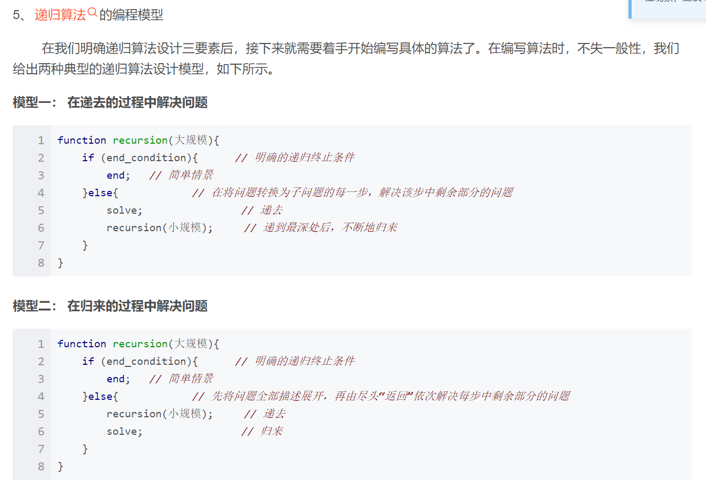
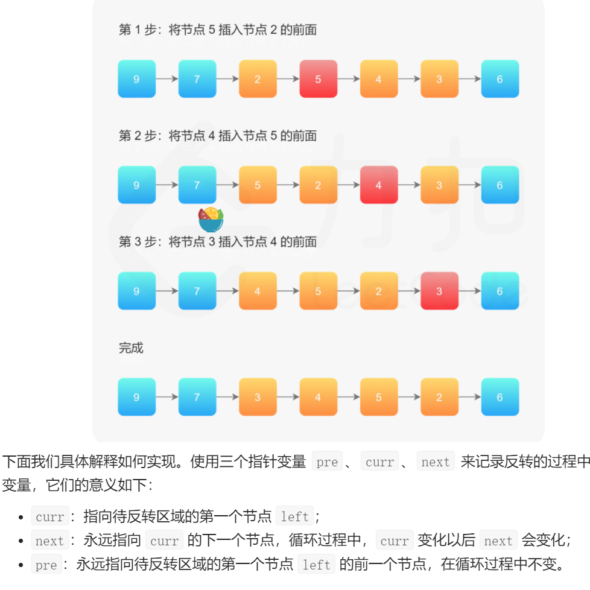
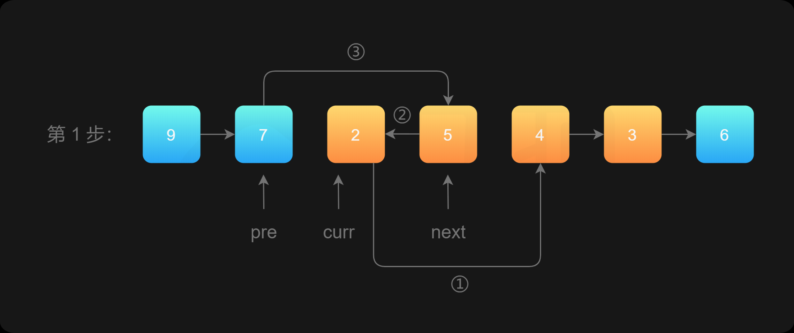
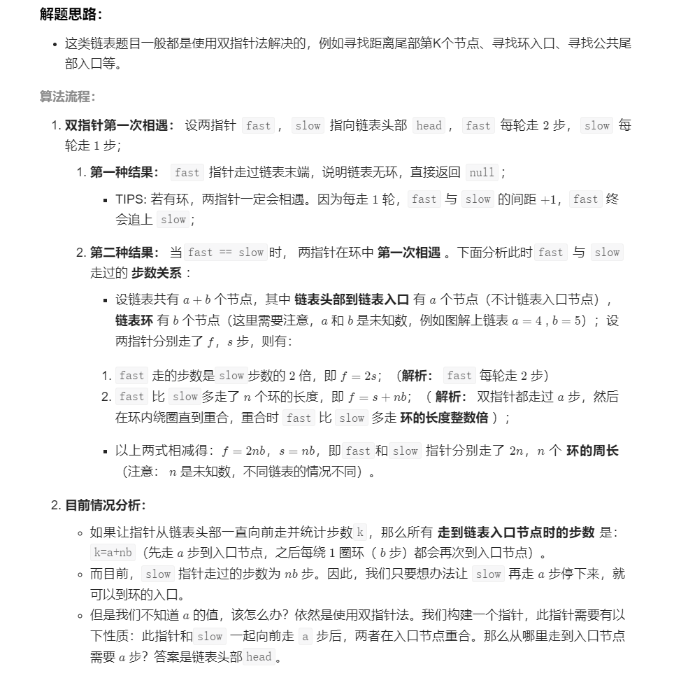
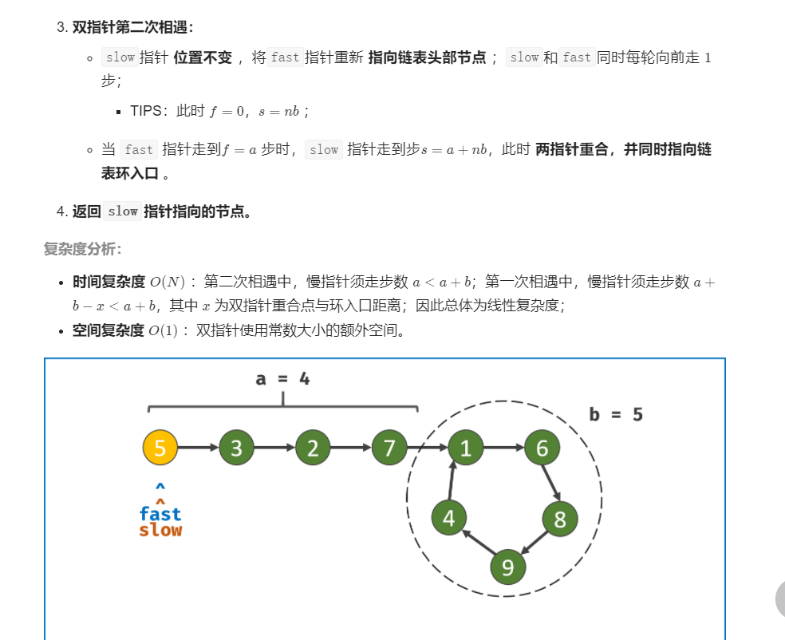
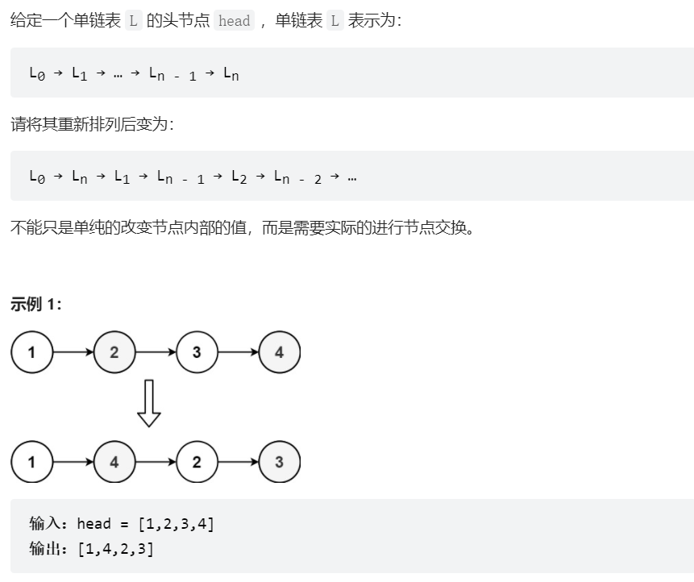

# 1. LinkedList

- [1. LinkedList](#1-linkedlist)
  - [1.1. 为什么需要虚拟头结点？头结点、头指针？](#11-为什么需要虚拟头结点头结点头指针)
  - [1.2. reverse list](#12-reverse-list)
  - [1.3. reverse list II](#13-reverse-list-ii)
  - [1.4. Middle node of linked list](#14-middle-node-of-linked-list)
  - [1.5. Linked List Cycle](#15-linked-list-cycle)
  - [1.6. Merge two sorted Linked List](#16-merge-two-sorted-linked-list)
  - [1.7. Palindrome Linked List](#17-palindrome-linked-list)
  - [1.8. add two numbers](#18-add-two-numbers)
  - [1.9. Partition Linked List](#19-partition-linked-list)
  - [1.10. merge sort Linked List](#110-merge-sort-linked-list)
  - [1.11. reorder list](#111-reorder-list)

## 1.1. 为什么需要虚拟头结点？头结点、头指针？

>这个问题可以参考链接 [头结点、头指针、首元结点](https://blog.csdn.net/qq_42615475/article/details/122181499?spm=1001.2101.3001.6650.1&utm_medium=distribute.pc_relevant.none-task-blog-2%7Edefault%7ECTRLIST%7ERate-1.pc_relevant_aa&depth_1-utm_source=distribute.pc_relevant.none-task-blog-2%7Edefault%7ECTRLIST%7ERate-1.pc_relevant_aa&utm_relevant_index=2)

```c
//这里插入关于链表中有无头节点进行初始化链表知识
//首先明白头指针与头结点的关系：http://www.nowamagic.net/librarys/veda/detail/1805
//定义结点的结构体
//typedef struct LNode{
//	int data;
//	struct LNode *next;
//}LNode,*LinkList;//则定义LinkList L;时，L为链表的头指针。
//
//L=(LinkList) malloc (sizeof(LNode)); //创建一个结点，此处返回给L的是一个指针，并且赋给了头指针。
//L->next=null; //这里说明我创建了一个头结点，即同时运用了头指针和头结点。
//这么方便只要加上->next就说明创建了头节点。不过你想想头指针是没有next的，只有头结点才有，所以就不难理解了
 
 
//带头结点初始化
//Node *head;  //声明头结点
//首先第一眼看到(*head)->next=NULL;和我们刚才所说是不是一样，只要头指针一旦运用了next操作就自动创建了头结点
//但是我们今天的重点不在于这个，更多在于Node **head，对于两个指针的操作理解
//第一个指针*head，表明了head这个指针变量存储的是另外一个指向结构体NODE的指针，第二个指针，即*head作为一个整体
//其结果是一个指针，其指向的内容就是结构体NODE。经过这么一理解，对于头指针，头结点，首元节点的关系就非常明朗了
//	void InitList(Node **head){
//		*head=(Node *)malloc( sizeof(Node));//这里需要明确的第一点，申请内存返回的都是地址
//		//第二点就是（Node *）表明了其返回的指针指向最后的结果是NODE的结构体，如果是指向int，那么我们就写(int *)
//		(*head)->next=NULL;
//}
 
 
//带头结点尾方便了首元节点和其他节点一样，统一了操作
	//方式一：
//	void CreatList(Node **head){
//		Node *r=*head,*s;//因为前面已经对头结点，头指针初始化过了，因此可以直接使用*head
//		int a;
//		while(scanf("%d",&a)){
//			if(a!=0){
//				s=(Node *)malloc(sizeof(Node));
//				s->value=a;
//				r->next=s;//这里没有着急设置s->next，原因在于后续还要插入数据。因此将s赋值给r
//				r=s;    
//			}
//			else{    
//				r->next=NULL;//如果后续输入的数据为空，则就将其设置为null
//				break;    
//			}
//		}
//}
//调用CreatList(&head);//这句话表明了形参Node **head，只有第一个*才是起作用了，第个*号是和head联系在一起，作为整体使用的
 
 
//方式二：
//	void CreatList(Node *head){
//		Node *r=head,*s;
//		... //下面的都一样
//}
//调用CreatList(head)；
//
 
//不带头结点初始化
//方式一：
//void InitList(Node **head){
//		*head=NULL;//这里直接就是指向的首元节点，还有之前自己一个误解，看到head就觉得它就是头指针了，其实它就是随便一个指针变量
         //并不是像自己之前想的那样的
 
 
		//从这里才发现，真正有无头节点的区别。
		//*head=(Node *)malloc( sizeof(Node));//这里需要明确的第一点，申请内存返回的都是地址
		//第二点就是（Node *）表明了其返回的指针指向最后的结果是NODE的结构体，如果是指向int，那么我们就写(int *)
		//(*head)->next=NULL;
//}
//调用InitList(&head)；
//
//方式二：
//void InitList(Node *head){
//		head=NULL;
//}
//调用InitList(head)；
 
//不带头结点尾插入，第一个节点与其他节点分开操作
//void CreatList(Node  **head){
//		Node *p,*t;         /*p工作指针,t临时指针*/
//		int a,i=1;
//		while(scanf("%d",&a)){
//			if(a!=0){
//				t=(Node *)malloc(sizeof(Node));
//				t->value=a;
//				if(i==1){
//					*head=t;    
//				}
//				else{
//					p->next=t;
//				}
//				p=t;
//			}
//			else{    
//				p->next=NULL;
//				break;    
//			}
//			i++;
//		}
//}
//调用CreatList(&head)；
//其实从上面就可以知道，其实有头结点对于我们来说是一种更加明智更加方便的操作
```


## 1.2. reverse list
给你单链表的头节点 head ，请你反转链表，并返回反转后的链表。  
>leetcode 206

解法一：迭代  
思路：在遍历链表时，将当前结点的next指针指向前一个结点而不是下一个。由于结点没有指针指向其前一个结点，所以需要保存下前一个结点，在更改指针前，还需要保存后一个结点。
```java
class Solution{
    public ListNode reverselist(ListNode head){
        if (head == null || head.next == null){
            return head;
        }
        ListNode pre = null;
        ListNode cur = head;
        while(cur != null){
            ListNode next = cur.next;
            cur.next = pre;
            pre = cur;
            cur = next;
        }
    }
}
```
解法二：递归  
思路：  
base case：首元结点的next指向null。  
recursion rule: 对当前链表进行反转的子问题是对子链表已经完成反转。  
为防止出现环，要让首元结点的next一定指向null。
```java
class Solution {
    public ListNode reverseList(ListNode head) {
        if (head == null || head.next == null) {
            return head;
        }
        ListNode newHead = reverseList(head.next);// 递归
        head.next.next = head;//边界条件，在归来的过程中solve
        head.next = null;
        return newHead;
    }
}
```  

## 1.3. reverse list II
部分反转链表：给你单链表的头指针 head 和两个整数 left 和 right ，其中 left <= right 。请你反转从位置 left 到位置 right 的链表节点，返回 反转后的链表。这里left指的是第left个元素，如left=2，第二个结点。
> leetcode 92

思路：在需要反转的区间里，每遍历到一个节点，让这个新节点来到反转部分的起始位置。  
步骤：使用三个指针变量pre，curr，next来记录反转的过程中的变量，curr指向待反转区域的第一个结点left，next永远指向curr的下一个结点，循环过程中，curr变化更新以后next会变化更新，pre永远指向待反转区域的第一个结点left的前一个结点，在循环过程中不变，不更新。




```java
class Solution {
    public ListNode reverseBetween (ListNode head, int left, int right) {
        ListNode dummyNode = new ListNode(-1);
        dummyNode.next = head;//定义dummy的next变量，才能表明dummy成为头结点，没有.next的只能称为头指针
        ListNode pre = dymmyNode;
        for (i = 0; i < left; i ++) {
            pre = pre.next;
        }
        ListNode curr = pre.next;
        ListNode next;
        for (i = 0; i < right - left + 1; i ++){
            next = curr.next; // 保存一下curr的后一个结点next，因为后面要更新
            curr.next = next.next;//断链，curr和后一个结点断开，curr.next指向后一个结点的后一个结点
            next.next = pre.next;// 接链，next的后一个结点变成pre.next, pre结点是不会更新的，永远指向left的前一个结点。在这里我之前错写成了 next.next=curr, 错在只看到了第一步的图，画到第二步就知道next.next应该指向pre.next，也就是待反转区域的原首结点。
            pre.next = next;//断链，pre和curr之间断开，pre.next指向next结点，这几步顺序不能换，否则会出现环。

        }
    }
}
```
## 1.4. Middle node of linked list
给定一个头结点为 head 的非空单链表，返回链表的中间结点。
如果有两个中间结点，则返回第二个中间结点。  
思路：快慢指针，用一个slow指针每次只移动一个结点，而fast指针每次移动两个结点，当fast指针指向尾结点时，slow指针刚好在middle结点处。
>leecode 876
```java
class Solution {
    public ListNode middleNode(ListNode head) {
        ListNode slow = head, fast = head;
        while (fast != null && fast.next != null) {  
            //关于奇偶的问题，当结点个数为偶数，两个中点，需返回后一个。奇数结点，一个中点，直接返回slow指针。  
            //奇数：fast的路线为1、3、5、、、、n，当fast到n时，fast.next = null  
            //此时slow走了（n+1）/2步，刚好到中点处，直接跳出循环返回slow  
            //偶数：fast的路线为1、3、5、、、、n-1,当fast到n-1时，下一次循环将会使fast直接等于null  
            //相当于最后一次循环fast 到了n+1个结点处，虽然不存在该结点  
            //此时slow走了(n+2)/2步，即n/2+1，刚好处于两个中点的后一个。
            slow = slow.next;
            fast = fast.next.next;
        }
        return slow;
    }
}
```
## 1.5. Linked List Cycle
给你一个链表的头节点 head ，判断链表中是否有环。  
如果链表中有某个节点，可以通过连续跟踪 next 指针再次到达，则链表中存在环。  
思路：使用快慢指针，如果链表中存在环，那么fast指针不会到空指针，因此和慢指针一定会相遇。
>leetcode 141
```java
public class Solution {
    public boolean hasCycle(ListNode head) {
        if (head == null || head.next == null) {
            return false;
        }
        ListNode slow = head;
        ListNode fast = head.next;
        while (slow != fast) {//这里由于循环条件是slow不等于fast，因此前面的初始化就要使slow和fast处于不同位置。
            if (fast == null || fast.next == null) {
                return false;
            }
            slow = slow.next;
            fast = fast.next.next;
        }
        return true;
    }
}
```
* 注意：因为这里我们的循环条件是slow不等于fast，因此我们需要将slow和fast的初始位置分开，不能让他们都指向head，因此我们将他们一个指向head一个指向head.next。   

>leetcode 142

给定一个链表的头节点  head ，返回链表开始入环的第一个节点。 如果链表无环，则返回 null.  
思路：  


```java
public class Solution {
    public ListNode detectCycle(ListNode head) {
        if(head == null || head.next == null){
            return null;
        }
        ListNode fast = head, slow = head;
        while (true) {
            if(fast == null || fast.next == null){
                return null;
            }
            slow = slow.next;
            fast = fast.next.next;
            if (slow == fast){
                break;
            }
        }
        fast = head;
        while (fast != slow){
            fast = fast.next;
            slow = slow.next;
        }
        return fast;
    }
}
```
## 1.6. Merge two sorted Linked List
>leetcode 21

将两个升序链表合并为一个新的 升序 链表并返回。新链表是通过拼接给定的两个链表的所有节点组成的。  
思路：
* 递归法  

```java
class Solution {
    public ListNode mergeTwoLists(ListNode l1, ListNode l2) {
        if (l1 == null) {
            return l2;
        }
        else if (l2 == null){
            return l1;
        }
        else if(l1.val <= l2.val){
            l1.next = mergeTwoLists(l1.next, l2);
            return l1;
        }
        else {
            l2.next = mergeTwoLists(l1, l2.next);
            return l2;
        }

    }
}
```
复杂度分析：  
时间复杂度：$O(n + m)$，其中 n 和 m 分别为两个链表的长度。因为每次调用递归都会去掉 l1 或者 l2 的头节点（直到至少有一个链表为空），函数 mergeTwoList 至多只会递归调用每个节点一次。因此，时间复杂度取决于合并后的链表长度，即 $O(n + m)$。

空间复杂度：$O(n + m)$，其中 n 和 m 分别为两个链表的长度。递归调用 mergeTwoLists 函数时需要消耗栈空间，栈空间的大小取决于递归调用的深度。结束递归调用时 mergeTwoLists 函数最多调用 n+m次，因此空间复杂度为 $O(n + m)$

* 迭代法  
我们可以用迭代的方法来实现上述算法。当 l1 和 l2 都不是空链表时，判断 l1 和 l2 哪一个链表的头节点的值更小，将较小值的节点添加到结果里，当一个节点被添加到结果里之后，将对应链表中的节点向后移一位。  
首先，我们设定一个哨兵节点 prehead ，这可以在最后让我们比较容易地返回合并后的链表。我们维护一个 prev 指针，我们需要做的是调整它的 next 指针。然后，我们重复以下过程，直到 l1 或者 l2 指向了 null ：如果 l1 当前节点的值小于等于 l2 ，我们就把 l1 当前的节点接在 prev 节点的后面同时将 l1 指针往后移一位。否则，我们对 l2 做同样的操作。不管我们将哪一个元素接在了后面，我们都需要把 prev 向后移一位。  
在循环终止的时候， l1 和 l2 至多有一个是非空的。由于输入的两个链表都是有序的，所以不管哪个链表是非空的，它包含的所有元素都比前面已经合并链表中的所有元素都要大。这意味着我们只需要简单地将非空链表接在合并链表的后面，并返回合并链表即可。
```java
class Solution {
    public ListNode mergeTwoLists(ListNode l1, ListNode l2) {
        ListNode prehead = new ListNode(-1);//哑结点是为了保持空链表和非空链表操作的统一性，并且由于最终要返回头结点，所以此处需要用另一个指针保存一下哑结点。

        ListNode prev = prehead;// 这里维护prev而不是prehead，其实都可以，因为他们指向同一块内存，所以都可以调用属性和方法。
        while (l1 != null && l2 != null) {
            if (l1.val <= l2.val) {
                prev.next = l1;
                l1 = l1.next;
            } else {
                prev.next = l2;
                l2 = l2.next;
            }
            prev = prev.next;
        }

        // 合并后 l1 和 l2 最多只有一个还未被合并完，我们直接将链表末尾指向未合并完的链表即可
        prev.next = l1 == null ? l2 : l1;

        return prehead.next;
    }
}

```
## 1.7. Palindrome Linked List
回文链表，给你一个单链表的头节点 head ，请你判断该链表是否为回文链表。如果是，返回 true ；否则，返回 false 。  
>leetcode 234

思路：

解法1：将值复制到数组中后用双指针法.  
有两种常用的列表实现，分别为数组列表和链表。如果我们想在列表中存储值，它们是如何实现的呢？

* 数组列表底层是使用数组存储值，我们可以通过索引在 O(1) 的时间访问列表任何位置的值，这是由基于内存寻址的方式。
* 链表存储的是称为节点的对象，每个节点保存一个值和指向下一个节点的指针。访问某个特定索引的节点需要 O(n) 的时间，因为要通过指针获取到下一个位置的节点。  

确定数组列表是否回文很简单，我们可以使用双指针法来比较两端的元素，并向中间移动。一个指针从起点向中间移动，另一个指针从终点向中间移动。这需要 O(n)的时间，因为访问每个元素的时间是 O(1)，而有n个元素要访问。

然而同样的方法在链表上操作并不简单，因为不论是正向访问还是反向访问都不是 O(1)。而将链表的值复制到数组列表中是 O(n)，因此最简单的方法就是将链表的值复制到数组列表中，再使用双指针法判断。

算法

一共为两个步骤：

1. 复制链表值到数组列表中。
2. 使用双指针法判断是否为回文。

第一步，我们需要遍历链表将值复制到数组列表中。我们用 currentNode 指向当前节点。每次迭代向数组添加 currentNode.val，并更新 currentNode = currentNode.next，当 currentNode = null 时停止循环。

执行第二步的最佳方法取决于你使用的语言。在 Python 中，很容易构造一个列表的反向副本，也很容易比较两个列表。而在其他语言中，就没有那么简单。因此最好使用双指针法来检查是否为回文。我们在起点放置一个指针，在结尾放置一个指针，每一次迭代判断两个指针指向的元素是否相同，若不同，返回 false；相同则将两个指针向内移动，并继续判断，直到两个指针相遇。

在编码的过程中，注意我们比较的是节点值的大小，而不是节点本身。正确的比较方式是：node_1.val == node_2.val，而 node_1 == node_2 是错误的。  
```java
class Solution {
    public boolean isPalindrome(ListNode head){
        ListNode ptr = head;
        List<Integer> vals = new ArrayList<Integer>();
        while(ptr != null){
            vals.add(ptr.val);
            ptr = ptr.next;
        }
        int left = 0;
        int right = vals.size() - 1;
        while(left <= right){
            if (!vals.get(left).equals(vals.get(right))){
                return false;
            }
            left ++;
            right --;
        }
        return true;
    }
}
```
* 复杂度分析  
时间复杂度：遍历一遍链表$O(n)$，对向遍历一遍数组最多也是$O(n/2)$，总时间复杂度$O(n)$.  
空间复杂度：$O(n)$，另外开辟了一个数组的空间.

解法2：快慢指针  
思路：利用快慢指针的慢指针刚好在快指针走完后停在链表中间的这一特性，先把链表一分为二，切成两条链表，再把后面的链表给反转一下，再把两个链表的每个结点值进行比较，即可知是否为回文。
* 注意：用慢指针分开的两个链表不是等长的，对于奇数的链表而言，应该在中点后断链，对于偶数的链表而言，应该在第一个中点后断链，这和我们寻找链表中点稍有不同，需要修改下循环条件。
```java
class Solution {
    public boolean isPalindrome(ListNode head){
        if (head == null){
            return true;
        }
        ListNode firstHalfEnd = middle(head);
        ListNode secondHalfStart = reverseList(firstHalfEnd.next);

        ListNode p1 = head;
        ListNode p2 = secondHalfStart;
        while (p1 != null && p2 != null){
            if (p1.val != p2.val){
                return false;
            }
            p1 = p1.next;
            p2 = p2.next;
        }
        return true;
    }
    public ListNode middle(ListNode head){
        ListNode fast = head;
        ListNode slow = head;
        while(fast.next != null && fast.next.next != null){//此处应该注意和之前那个找中点题目中的循环条件不同，这个循环条件可以让偶数情况下的中点变为第一个中点，而奇数情况下不影响。
            slow = slow.next;
            fast = fast.next.next;
        }
        return slow;
    }
    public ListNode reverseList(ListNode head){
        if (head == null || head.next == null){
            return head;
        }
        ListNode newhead = reverseList(head.next);
        head.next.next = head;
        head.next = null;
        return newhead;
    }
}
```
* 复杂度分析  
时间复杂度：比较俩链表，花费$O(n)$，找链表中点，花费$O(n)$，反转链表，花费$O(n)$,总共复杂度$O(n)$。  
空间复杂度：有递归存在，反转链表用到了递归，因此有栈空间占用，复杂度$O(n)$。

## 1.8. add two numbers
>leetcode 2
给你两个 非空 的链表，表示两个非负的整数。它们每位数字都是按照 逆序 的方式存储的，并且每个节点只能存储 一位 数字。

请你将两个数相加，并以相同形式返回一个表示和的链表。

你可以假设除了数字 0 之外，这两个数都不会以 0 开头。

思路：由于输入的两个链表都是逆序存储数字的位数的，因此两个链表中同一位置的数字可以直接相加。

我们同时遍历两个链表，逐位计算它们的和，并与当前位置的进位值相加。具体而言，如果当前两个链表处相应位置的数字为 n1,n2，进位值为carry，则它们的和为 n1+n2+carry；其中，答案链表处相应位置的数字为 (n1+n2+carry)mod 10，而新的进位值为(n1+n2+carry) / 10，如果两个链表的长度不同，则可以认为长度短的链表的后面有若干个 0。

此外，如果链表遍历结束后，有carry>0，还需要在答案链表的后面附加一个节点，节点的值为carry。
```java
class Solution {
    public ListNode addTwoNumbers(ListNode l1, ListNode l2){
        ListNode head = null, tail = null;
        int carry = 0;
        while (l1 != null || l2 != null){// 循环退出条件设置为两个链表均为空。因为我们要将短的链表差的那部分看作0；  
        //
            int n1 = l1 != null ? l1.val : 0;
            int n2 = l2 != null ? l2.val : 0;
            int sum = n1 + n2 + carry;
            if(head == null){// 头结点的情况需要单独讨论
                head = new ListNode(sum % 10);
                tail = head;
            }
            else {
                tail.next = new ListNode(sum % 10);
                tail = tail.next;
            }
            carry = sum / 10;
            if (l1 != null){// 这里要判断是否为空，不然再往后移会出现空指针异常
                l1 = l1.next;
            }
            if (l2 != null){
                l2 = l2.next;
            }
        }
        if (carry > 0){
            tail.next = new ListNode(carry);
        }
        return head;
    }
}
```

## 1.9. Partition Linked List
>leecode 86

给你一个链表的头节点 head 和一个特定值 x ，请你对链表进行分隔，使得所有 小于 x 的节点都出现在 大于或等于 x 的节点之前。

你应当 保留 两个分区中每个节点的初始相对位置。

思路：把这个链表分为两个链表，一个保存小于x的结点，一个保存大于或等于x的结点，最后把两个链表接在一起。
```java
class Solution {
    public ListNode partition(ListNode head, int x){
        ListNode small = new ListNode(0);//此处设置哑结点，因为我们要统一空链表和非空链表的操作。  
        //如果没有该哑结点，那么我们在第一次从空链表指向第一个结点的时候，需要让head = firstnode  
        //而有了首元结点后，下一次以及之后指向新结点会变为head.next = newnode, head = head.next。  
        //如果有哑结点，那么我们在每一次添加新结点的操作都是dummy.next = newnode, dummy = dummy.next;
        ListNode smallHead = small;// 此处我们应保留一下哑结点地址，因为哑结点指针会在后续操作中不断添加新结点而导致更新后移。  
        //保存留待后续返回整个链表头结点时使用。
        ListNode large = new ListNode(0);
        ListNode largeHead = large;
        while (head != null){
            if (head.val < x){
                small.next = head;
                small = small.next;
            }
            else {
                large.next = head;
                large = large.next;
            }
            head = head.next;
        }
        small.next = largeHead.next;
        large.next = null;
        return smallHead.next;
    }
}
```
复杂度分析：
* 时间复杂度: O(n)，其中 n 是原链表的长度。我们对该链表进行了一次遍历。
* 空间复杂度: O(1)。不需要开辟两个新链表，只需要在原链表基础上把部分地址连在一起就可以。

## 1.10. merge sort Linked List
>leecode 148

给一个链表排序，返回排列好的链表。  
思路：使用merge sort归并排序，递归的方式解决两个一半的链表，最后将sort好的两个链表merge起来。可以使用快慢指针将列表切割开，变成两个链表。
```java
class Solution {
    public ListNode sortList(ListNode head) {
        if (head == null || head.next == null){
            return head;//边界条件，递归中止，剩一个结点的链表直接返回头结点。
        }
        ListNode fast = head, slow = head;
        while (fast.next != null && fast.next.next != null) {
            slow = slow.next;
            fast = fast.next.next;
        }
        ListNode tmp = slow.next;
        slow.next = null;// 断链
        ListNode left = sortList(head);
        ListNode right = sortList(tmp);
        ListNode h = new ListNode(0);//设置dummy node来merge两个sorted list。
        ListNode res = h;// 哑结点是为了保持空链表和非空链表操作的统一性，并且由于最终要返回头结点，所以此处需要用另一个指针保存一下哑结点。
        while (left != null && right != null) {
            if (left.val < right.val) {
                h.next = left;
                left = left.next;
            } else {
                h.next = right;
                right = right.next;
            }
            h = h.next;
        }
        h.next = left != null ? left : right;//两个中有一个为null后跳出循环在此判断应该接上哪个。
        return res.next;
    }
}

```

复杂度分析：
* 时间复杂度：$O(nlogn)$，其中n是链表的长度。  
* 空间复杂度：$O(logn)$，其中n是链表的长度。空间复杂度主要取决于递归调用的栈空间。

## 1.11. reorder list
>leetcode 143


思路：使用快慢指针把链表切分为两条，如果链表有奇数个结点，那么从中点后面切，如果是偶数，从第一个中点后米娜切。然后反转后面的那条链表，  

```java
class Solution {
    public ListNode reorderList(ListNode head) {
        if (head == null || head.next == null){
            return head;//单独排除只有一个节点或空链表的情况，防止后面忘记再分支出来。
        }
        ListNode newhead = head;
        ListNode slow = head, fast = head;
        while(fast.next != null && fast.next.next != null){// 快慢指针，循环条件设置为这个，可以让奇数的链表slow停在中点，偶数的链表slow停留在第一个中点。
            slow = slow.next;
            fast = fast.next.next;
        }
        ListNode tmp = slow.next;
        slow.next = null;
        ListNode pre = null;
        ListNode curr = tmp;
        while (curr != null){
            ListNode next = curr.next;
            curr.next = pre;
            pre = curr;
            curr = next;
        }
        while (pre != null){
            ListNode preNext = pre.next;//易错点，保留第二条链表当前结点的下一个。
            ListNode headNext = head.next;//保留第一条链表当前结点的下一个，因为当前结点是要更新的。
            pre.next = head.next;
            head.next = pre;
            head = headNext;
            pre = preNext;
            //pre.next = head.next;
            //head.next = pre;
            //head = pre;
            //pre = preNext;
        }
        return newhead;
    }
}
```
复杂度分析：
* 时间复杂度：$O(n)$,因为需要遍历两条链表的每一个结点。
* 空间复杂度：$O(1)$, 没有递归，也没有开辟新的链表或数组。