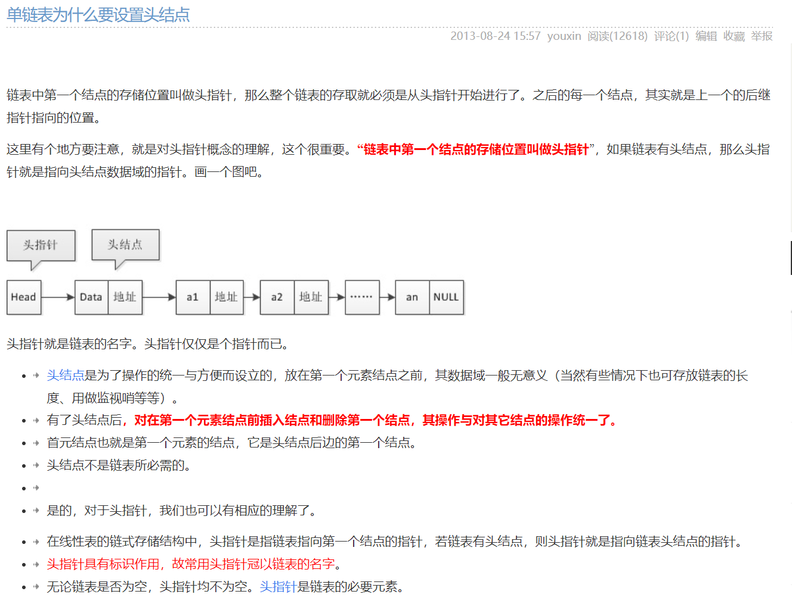
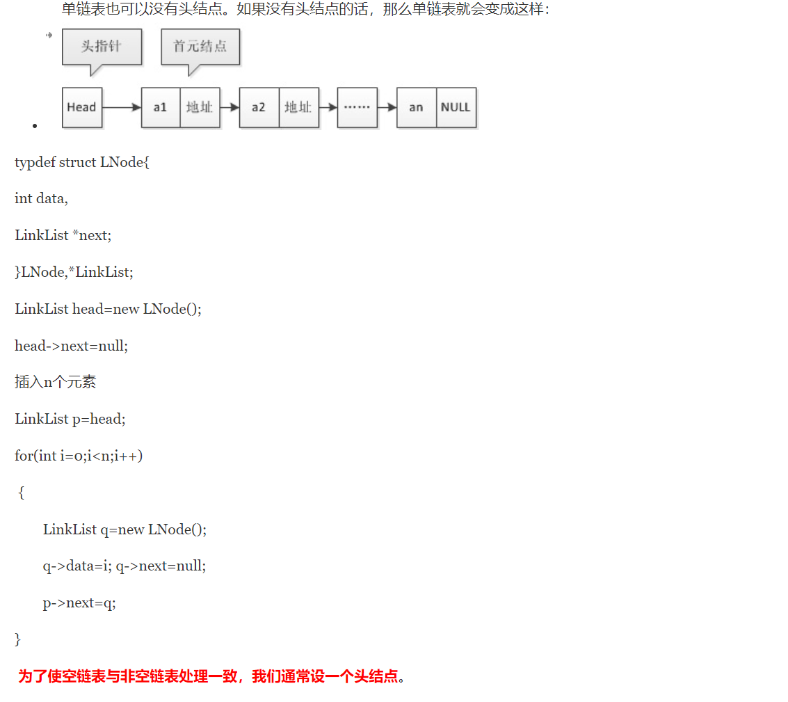

# LinkedList
## 为什么需要虚拟头结点？头结点、头指针？




## 1. reverse list
给你单链表的头节点 head ，请你反转链表，并返回反转后的链表。  
>leetcode 206

解法一：迭代  
思路：在遍历链表时，将当前结点的next指针指向前一个结点而不是下一个。由于结点没有指针指向其前一个结点，所以需要保存下前一个结点，在更改指针前，还需要保存后一个结点。
```java
class Solution{
    public ListNode reverselist(ListNode head){
        if (head == null || head.next == null){
            return head;
        }
        ListNode pre = null;
        ListNode cur = head;
        while(cur != null){
            ListNode next = cur.next;
            cur.next = pre;
            pre = cur;
            cur = next;
        }
    }
}
```
解法二：递归  
思路：  
base case：首元结点的next指向null。  
recursion rule: 对当前链表进行反转的子问题是对子链表已经完成反转。  
为防止出现环，要让首元结点的next一定指向null。  
## 2. reverse list II
部分反转链表：给你单链表的头指针 head 和两个整数 left 和 right ，其中 left <= right 。请你反转从位置 left 到位置 right 的链表节点，返回 反转后的链表。这里left指的是第left个元素，如left=2，第二个结点。
> leetcode 92

思路：