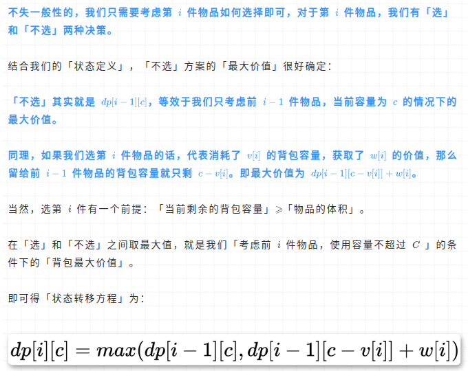

- [动态规划](#动态规划)
  - [1. 剪绳子问题](#1-剪绳子问题)
  - [2. array hopper (jump game)](#2-array-hopper-jump-game)
  - [3. array hopper(jump game) II](#3-array-hopperjump-game-ii)
  - [4. largest subarray sum 最大子数组和](#4-largest-subarray-sum-最大子数组和)
  - [5. dictionary word I](#5-dictionary-word-i)
  - [6. 斐波那契数列](#6-斐波那契数列)
  - [7. 最长连续递增序列](#7-最长连续递增序列)
  - [8. 正则表达式匹配](#8-正则表达式匹配)
  - [9. 解码方法](#9-解码方法)
  - [10. 最长公共子序列](#10-最长公共子序列)
  - [11. 不同的子序列](#11-不同的子序列)
  - [12. 打家劫舍](#12-打家劫舍)
  - [13. 打家劫舍 II](#13-打家劫舍-ii)
  - [14. 解码方法II](#14-解码方法ii)
- [dp里的路径问题](#dp里的路径问题)
  - [15. 不同路径](#15-不同路径)
  - [16. 不同路径II](#16-不同路径ii)
  - [17. 最小路径和](#17-最小路径和)
  - [18. 三角形最小路径和](#18-三角形最小路径和)
    - [滚动数组的概念](#滚动数组的概念)
    - [位运算和取余](#位运算和取余)
  - [19. 下降路径最小和](#19-下降路径最小和)
- [线性 DP](#线性-dp)
  - [1. 爬楼梯](#1-爬楼梯)
  - [2. 杨辉三角 II](#2-杨辉三角-ii)
- [背包dp](#背包dp)
  - [1. 从0-1背包问题开始讲起](#1-从0-1背包问题开始讲起)
  - [2. 分割等和子集](#2-分割等和子集)
  - [3. 完全平方数](#3-完全平方数)
  - [4. 零钱兑换](#4-零钱兑换)
- [序列 DP](#序列-dp)
  - [1. 最长公共子序列](#1-最长公共子序列)
  - [2. 单词拆分](#2-单词拆分)
    - [线性DP和序列DP之间的区别](#线性dp和序列dp之间的区别)
  - [3. 最长递增子序列](#3-最长递增子序列)
  - [4. 乘积最大子数组](#4-乘积最大子数组)
  - [5. 最长回文子串](#5-最长回文子串)
  - [6. 最长公共子序列](#6-最长公共子序列)
- [状态机线性 DP（线性dp的一种）](#状态机线性-dp线性dp的一种)
  - [1. 打家劫舍](#1-打家劫舍)


* [理解动态规划](https://leetcode.cn/problems/maximum-subarray/solution/dong-tai-gui-hua-fen-zhi-fa-python-dai-ma-java-dai/)这个链接里讲到了动态规划的一些步骤和理解，怎样定义子问题，什么是子问题的无后效性，怎样定义要填的表，怎么定义状态转移方程，思考初始值，最后进行空间优化。
* [宫水三叶关于动态规划的一些总结，也提到了无后效性](https://mp.weixin.qq.com/s?__biz=MzU4NDE3MTEyMA==&mid=2247485037&idx=1&sn=d6d52c48600e655161e84f25d3402514&scene=21#wechat_redirect)
* [关于无后效性的通俗理解](https://blog.csdn.net/skh2015java/article/details/115873380)  「无后效性」的定义：我们转移某个状态需要用到某个值，但是并不关心该值是如何而来的。「更加的学术表达是：当前某个状态确定后，之后的状态转移与之前的决策无关」

# 动态规划
## 1. 剪绳子问题

>leetcode 剑指offer14-1

```java
class Solution {
    public int cuttingRope(int n) {
        int[] m = new int[n + 1];
        m[0] = 0;
        m[1] = 0;
        m[2] = 1;
        for (int i = 3; i <= n; i ++){
            int max = 0;
            for (int j = 1; j < i; j++){
                //max = Math.max(max, j * Math.max(i - j, m[i - j])); // 切右段不切左段，且要考虑右段不切的情况
                max = Math.max(max, Math.max(j, m[j]) * (i - j)); // 切左段不切右段，j不需要等于i，因为m[0]为0，相乘肯定是0。
            }
            m[i] = max;
        }
        return m[n];
    }
}
```

```java
class Solution {
    public int cuttingRope(int n) {
        int[] m = new int[n + 1];
        for (int i = 0; i <= n; i ++){ // 如果不加base case边界条件，让绳子长度从0开始也可以。
            int max = 0;
            for (int j = 1; j < i; j++){
                //max = Math.max(max, j * Math.max(i - j, m[i - j])); // 切右段不切左段，且要考虑右段不切的情况
                max = Math.max(max, Math.max(j, m[j]) * (i - j)); // 切左段不切右段，j不需要等于i，因为m[0]为0，相乘肯定是0。
            }
            m[i] = max;
        }
        return m[n];
    }
}
```
TC: O(n^2);
Sc: O(n);


## 2. array hopper (jump game)

>leetcode 55

贪心算法，在每个能跳跃的最远距离内，挨个计算下一个能跳到的最远距离，只要这个最远距离能比最后的数组位置大就行。每次都贪心的选择了最远的距离。

```java
class Solution {
    public boolean canJump(int[] nums) {
        int rightmost = 0;
        for (int i = 0; i < nums.length; i++){
            if (i <= rightmost){
                rightmost = Math.max(rightmost, i + nums[i]);
            }
            if (rightmost >= nums.length - 1){
                return true;
            }
        }
        return false;
    }
}
```
TC: O(n);
SC: O(1);

## 3. array hopper(jump game) II

>leetcode 45
贪心算法，每次都直接跳当前范围内能跳的最远距离，就能保证跳的次数最少。

```java
class Solution {
    public int jump(int[] nums) {
        int res = 0;
        int start = 0;
        int end = 1;
        while(end < nums.length){
            int rightmost = 0;
            for (int i = start; i < end; i ++){
                rightmost = Math.max(rightmost, i + nums[i]);
            }
            start = end; // 下次跳跃的起始位置；
            end = rightmost + 1; // 下次跳跃的结束位置；
            res ++; // 跳跃次数
        }
        return res;
    }
}
```
TC: O(n);
SC: O(1);

## 4. largest subarray sum 最大子数组和

>leetcode 53

[理解动态规划](https://leetcode.cn/problems/maximum-subarray/solution/dong-tai-gui-hua-fen-zhi-fa-python-dai-ma-java-dai/)这个链接里讲到了动态规划的一些步骤和理解，怎样定义子问题，什么是子问题的无后效性，怎样定义要填的表，怎么定义状态转移方程，思考初始值，最后进行空间优化。

```java
// 解法一
public class Solution {

    public int maxSubArray(int[] nums) {
        int len = nums.length;
        // dp[i] 表示：以 nums[i] 结尾的连续子数组的最大和
        int[] dp = new int[len];
        dp[0] = nums[0];

        for (int i = 1; i < len; i++) {
            if (dp[i - 1] > 0) {
                dp[i] = dp[i - 1] + nums[i];
            } else {
                dp[i] = nums[i];
            }
        }

        // 也可以在上面遍历的同时求出 res 的最大值，这里我们为了语义清晰分开写，大家可以自行选择
        int res = dp[0];
        for (int i = 1; i < len; i++) {
            res = Math.max(res, dp[i]);
        }
        return res;
    }
}

// 解法二
// 空间优化
class Solution {
    public int maxSubArray(int[] nums) {
        int pre = 0;
        int res = nums[0];
        for (int i = 0; i < nums.length; i++){
            pre = Math.max(pre + nums[i], nums[i]);
            res = Math.max(res, pre);
        }
        return res;
    }
}

```

## 5. dictionary word I

>leetcode 139

```java
class Solution {
    public boolean wordBreak(String s, List<String> wordDict) {
        Set<String> set = new HashSet<>();
        for (String word : wordDict) set.add(word);
        int n = s.length();
        boolean[] f = new boolean[n + 10];
        f[0] = true;
        for (int i = 1; i <= n; i++) {
            for (int j = 1; j <= i && !f[i]; j++) {
                String sub = s.substring(j - 1, i);
                if (set.contains(sub)) f[i] = f[j - 1]; 
            }
        }
        return f[n];
    }
}
```

```java
public class Solution {
    public boolean wordBreak(String s, List<String> wordDict) {
        Set<String> wordDictSet = new HashSet(wordDict);
        boolean[] dp = new boolean[s.length() + 1];
        dp[0] = true;
        for (int i = 1; i <= s.length(); i++) {
            for (int j = 0; j < i; j++) {
                if (dp[j] && wordDictSet.contains(s.substring(j, i))) {
                    dp[i] = true;
                    break;
                }
            }
        }
        return dp[s.length()];
    }
}
```

## 6. 斐波那契数列

>leetcode 10-1 剑指offer

```java
class Solution {
    public int fib(int n) {
        if (n <= 1){
            return n;
        }
        int[] fb = new int[n + 1];
        fb[0] = 0;
        fb[1] = 1;
        for (int i = 2; i <= n; i++){
            fb[i] = fb[i - 1] + fb[i - 2];
        }
        return fb[n];
    }
}
```

空间优化

```java
class Solution {
    public int fib(int n) {
        if (n <= 1){
            return n;
        }
        final int MOD = 1000000007;
        int res = 0;
        int a = 0;
        int b = 1;
        for (int i = 2; i <= n; i++){
            res = (a + b) % MOD;
            a = b;
            b = res;
        }
        return res;
    }
}
```
TC: O(n);
SC: O(1);

采用矩阵的快速幂，可以将时间复杂度降至O(log n);

## 7. 最长连续递增序列

>leetcode 674

```java
class Solution {
    public int findLengthOfLCIS(int[] nums) {
        if(nums.length <= 1)
            return nums.length;
        int ans = 1;
        int count = 1;
        for(int i=0;i<nums.length-1;i++) {
            if(nums[i+1] > nums[i]) {
                count++;
            } else {  
                count = 1;
            }
            ans = count > ans ? count : ans;
        }
        return ans;

    }
}
```

## 8. 正则表达式匹配

>leetcode 10 

宫水三叶，主要的困难就是在状态转移方程的推导，子问题的定义，看下她的数学推导过程吧。尤其是第三个if分支。

```java
class Solution {
    public boolean isMatch(String s, String p) {
        int n = s.length();
        int m = p.length();    
        s = " " + s;
        p = " " + p;
        char[] ss = s.toCharArray();
        char[] pp = p.toCharArray();
        boolean[][] f = new boolean[n + 1][m + 1];
        f[0][0] = true;
        for (int i = 0; i <= n; i ++){
            for (int j = 1; j <= m; j++){
                if (j + 1 <= m && pp[j + 1] == '*'){
                    continue;
                }
                if (i - 1 >= 0 && pp[j] != '*'){
                    f[i][j] = f[i - 1][j - 1] && (ss[i] == pp[j] || pp[j] == '.');
                }
                else if (pp[j] == '*'){
                    f[i][j] = (j - 2 >= 0 && f[i][j - 2]) || (i - 1 >= 0 && f[i - 1][j] && (ss[i] == pp[j - 1] || pp[j - 1] == '.'));
                }
            }
        }
        return f[n][m];
    }
}
```

TC: O(nm);
SC: O(nm);

## 9. 解码方法

>leetcode 91

```java
class Solution {
    public int numDecodings(String s) {
        int n = s.length();
        s = " " + s; // 加个空格在前面当哨兵，可以避免特殊判断前导零，还可以避免判断i - 1这种为负数的情况。
        char[] array = s.toCharArray();
        int[] f = new int[n + 1];
        f[0] = 1;
        for (int i = 1; i <= n; i ++){
            int a = array[i] - '0';
            int b = (array[i - 1] - '0') * 10 + array[i] - '0';
            if (a >= 1 && a <= 9){
                f[i] = f[i - 1];
            }
            if (b >= 10 && b <= 26){ // 最重要的分支就是这里，如果b是10或者20的话，那么f[i]是直接等于f[i - 2]的，因为没有走上面的分支，如果b是11到19，21到26的话，那么其实f[i]就等于f[i - 1]加f[i - 2]了。
                f[i] = f[i] + f[i - 2];
            }
        }
        return f[n];
    }
}
```

TC: O(n);
SC: O(n);

空间优化，这里f[i]只和f[i - 1], f[i - 2]有关，所以我们可以直接换成三个变量，滚动变量。

```java
class Solution {
    public int numDecodings(String s){
        int n = s.length();
        s = " " + s;
        char[] array = s.toCharArray();
        int x = 0, y = 1, z = 0; // 这里x代表f[i -2], y 代表 f[i - 1], z 代表 f[i]，此时y就意味着初始状态，解码前一个字符的方法个数为1，第一个字符是空格。
        for (int i = 1; i <= n; i ++){
            int a = array[i] - '0';
            int b = (array[i - 1] - '0') * 10 + array[i] - '0';
            z = 0; // 在这里z一定要在每次循环开始重新置为0，因为我们更新x，y之后，z就只和x，y有关，不能受到上次z的结果的影响。
            if (a >= 1 && a <= 9){
                z = y;
            }
            if (b >= 10 && b <= 26){
                z = z + x;
            }
            x = y;
            y = z; 
        }
        return z;
    }
}
```

## 10. 最长公共子序列

>leetcode 1143

```java
class Solution {
    public int longestCommonSubsequence(String s1, String s2) {
        int m = s1.length();
        int n = s2.length();
        //s1 = " " + s1;
        //s2 = " " + s2;
        char[] array1 = s1.toCharArray();
        char[] array2 = s2.toCharArray();
        int[][] f = new int[m + 1][n + 1];
        f[0][0] = 0;
        for (int i = 1; i <= m; i ++){
            for (int j = 1; j <= n; j ++){
                if (array1[i - 1] == array2[j - 1]){
                    f[i][j] = f[i - 1][j - 1] + 1;
                }
                else {
                    f[i][j] = Math.max(f[i][j - 1], f[i - 1][j]);
                }
            }
        }
        return f[m][n];
    }
}
```

## 11. 不同的子序列

>leetcode 115

这里宫水三叶指出了[字符串匹配问题的一种状态普遍定义方法](https://leetcode.cn/problems/distinct-subsequences/solution/xiang-jie-zi-fu-chuan-pi-pei-wen-ti-de-t-wdtk/)

```java
class Solution {
    public int numDistinct(String s, String t) {
        int m = s.length();
        int n = t.length();
        s = " " + s;
        t = " " + t;
        char[] array1 = s.toCharArray();
        char[] array2 = t.toCharArray();
        int[][] f = new int[m + 1][n + 1];
        for (int i = 0; i <= m; i ++){
            f[i][0] = 1;
        }
        for (int i = 1; i <= m; i++){
            for (int j = 1; j <= n; j++){
                f[i][j] = f[i - 1][j];
                if (array1[i] == array2[j]){
                    f[i][j] += f[i - 1][j - 1];
                }
            }
        }
        return f[m][n];
    }
}
```

## 12. 打家劫舍

>leetcode 198

感觉官方题解要比宫水三叶的好理解一些。

```java
class Solution {
    public int rob(int[] nums) {
        int n = nums.length;
        int[] f = new int[n + 1];
        f[0] = 0;
        f[1] = nums[0];
        for (int i = 2; i <= n; i ++){
            f[i] = Math.max(f[i - 2] + nums[i - 1], f[i - 1]); // 有偏移
        }
        return f[n];
    }
}
```
空间优化

```java
class Solution {
    public int rob(int[] nums) {
        int n = nums.length;
        if (n <= 1){
            return nums[0];
        }
        int[] f = new int[n + 1];
        int a = 0;
        int b = nums[0];
        int res = 0;
        for (int i = 2; i <= n; i ++){
            res = Math.max(a + nums[i - 1], b);
            a = b;
            b = res;
        }
        return res;
    }
}

// 没有偏移

class Solution {
    public int rob(int[] nums) {
        int n = nums.length;
        if (n == 1){
            return nums[0];
        }
        if (n == 2){
            return Math.max(nums[0], nums[1]);
        }
        int a = nums[0];
        int b = Math.max(nums[0], nums[1]);
        int res = 0;
        for (int i = 2; i < n; i ++){
            res = Math.max(a + nums[i], b);
            a = b;
            b = res;
        }
        return res;
    }
}
```

## 13. 打家劫舍 II

>leetcode 213

```java
class Solution {
    public int rob(int[] nums) {
        int n = nums.length;
        if(n == 1){
            return nums[0];
        }
        if (n == 2){
            return Math.max(nums[0], nums[1]);
        }
        return Math.max(robRange(nums, 0, n - 2), robRange(nums, 1, n - 1));
    }
    public int robRange(int[] nums, int start, int end){
        int[] f = new int[end - start + 1];
        f[0] = nums[start];
        f[1] = Math.max(nums[start], nums[start + 1]);
        for (int i = 2; i < end - start + 1; i ++){
            f[i] = Math.max(f[i - 2] + nums[start + i], f[i - 1]);
        }
        return f[end - start];
    }
}

// 空间优化

class Solution {
    public int rob(int[] nums) {
        int n = nums.length;
        if(n == 1){
            return nums[0];
        }
        if (n == 2){
            return Math.max(nums[0], nums[1]);
        }
        return Math.max(robRange(nums, 0, n - 2), robRange(nums, 1, n - 1));
    }
    public int robRange(int[] nums, int start, int end){
        int a = nums[start];
        int b = Math.max(nums[start], nums[start + 1]);
        
        for (int i = start + 2; i <= end; i ++){ // 与之前的三变量滚动不同，双变量的滚动，可以保证b始终是我们要的那个结果，且能避免数组只有两个元素的特判。
            int temp = b;
            b = Math.max(a + nums[i], b);
            a = temp;
            
        }
        return b;
    }
}

```
## 14. 解码方法II

>leetcode 639

这个题分支太多，后续的空间优化，宫水三叶习惯使用滚动数组，待后续我添加进来，就能让空间复杂度优化为O(1)；

```java
class Solution {
    int mod = (int)1e9+7;
    public int numDecodings(String s) {
        int n = s.length();
        char[] array = s.toCharArray();
        long[]f = new long[n];
        f[0] = array[0] == '*' ? 9 : (array[0] != '0' ? 1 : 0);
        for (int i = 1; i < n; i ++){
            char c = array[i];
            char pre = array[i - 1];
            if (c == '*'){ // 当前字符为'*'
                // array[i] 单独作为一个item
                f[i] += f[i - 1] * 9;
                // array[i] 与前一个字符共同解码成一个item
                if (pre == '*'){
                    f[i] += (i - 2 >= 0 ? f[i - 2] : 1) * 15;
                }
                else {
                    int digit = pre - '0';
                    if (digit == 1){
                        f[i] += (i - 2 >= 0 ? f[i - 2] : 1) * 9;
                    }
                    else if (digit == 2){
                        f[i] += (i - 2 >= 0 ? f[i - 2] : 1) * 6;
                    }
                }
            }
            else { // 当前字符为正常数字
                int digit = c - '0';
                if (pre == '*'){ // 上一个字符为'*'
                    if (digit == 0){
                        f[i] = (i - 2 >= 0 ? f[i - 2] : 1) * 2;
                    }
                    else { 
                        // array[i] 单独作为一个item
                        f[i] = f[i - 1];
                        // array[i] 和前一个字符共同作为一个item
                        if (digit <= 6){
                            f[i] += (i - 2 >= 0 ? f[i - 2] : 1) * 2;
                        }
                        else {
                            f[i] += i - 2 >= 0 ? f[i - 2] : 1;
                        }
                    }
                }
                else { // 上一个字符为正常数字
                    int number = pre - '0';
                    if (digit == 0){
                        if (number == 1 || number == 2){
                            f[i] = i - 2 >= 0 ? f[i - 2] : 1;
                        }
                    }
                    else {
                        // array[i] 单独作为一个item
                        f[i] = f[i - 1];
                        // array[i] 和上一个字符共同作为一个item
                        if (number == 1){
                            f[i] += i - 2 >= 0 ? f[i - 2] : 1;
                        }
                        else if (number == 2 && digit <= 6){
                            f[i] += i - 2 >= 0 ? f[i - 2] : 1;
                        }
                    }
                }
            }
            f[i] %= mod;
        }
        return (int)f[n - 1];
    }
}
```


# dp里的路径问题

## 15. 不同路径

>leetcode 62

```java
class Solution {
    public int uniquePaths(int m, int n) {
        int[][] f = new int[m][n];
        f[0][0] = 1;
        for (int i = 0; i < m; i ++){
            for (int j = 0; j < n; j ++){
                if(i > 0  && j > 0){
                    f[i][j] = f[i][j - 1] + f[i - 1][j];
                }
                else if (j > 0){
                    f[i][j] = f[i][j - 1];
                }
                else if (i > 0){
                    f[i][j] = f[i - 1][j];
                }
            }
        }
        return f[m - 1][n - 1];
    }
}
```

## 16. 不同路径II

>leetcode 63

```java
class Solution {
    public int uniquePathsWithObstacles(int[][] obstacleGrid) {
        int m = obstacleGrid.length;
        int n = obstacleGrid[0].length;
        int[][] f = new int[m][n];
        f[0][0] = 1;
        for (int i = 0; i < m; i++){
            for (int j = 0; j < n; j ++){
                if(obstacleGrid[i][j] == 1){
                    f[i][j] = 0;
                }
                else {
                    if (i > 0 && j > 0){
                        f[i][j] = f[i - 1][j] + f[i][j - 1];
                    }
                    else if (i > 0){
                        f[i][j] = f[i - 1][j];
                    }
                    else if (j > 0){
                        f[i][j] = f[i][j - 1];
                    }
                }
            }
        }
        return f[m - 1][n - 1];
    }
}
```
## 17. 最小路径和

>leetcode 64 

```java
class Solution {
    public int minPathSum(int[][] grid) {
        int m = grid.length;
        int n = grid[0].length;
        int[][] f = new int[m][n];
        f[0][0] = grid[0][0];
        for (int i = 0; i < m; i++){
            for (int j = 0; j < n; j ++){
                if (i > 0 && j > 0){
                    f[i][j] = Math.min(f[i - 1][j] + grid[i][j], f[i][j - 1] + grid[i][j]);
                }
                else if (i > 0){
                    f[i][j] = f[i - 1][j] + grid[i][j];
                }
                else if (j > 0){
                    f[i][j] = f[i][j - 1] + grid[i][j];
                }
            }
        }
        return f[m - 1][n - 1];
    }
}
```

## 18. 三角形最小路径和

### [滚动数组的概念](https://juejin.cn/post/6854573217185529864)

### [位运算和取余](https://www.jianshu.com/p/0711e9eb8cef)

>leetcode 120

```java
// tc: O(n^2)
// sc: O(n^2)
class Solution {
    public int minimumTotal(List<List<Integer>> tri) {
        int n = tri.size();
        int ans = Integer.MAX_VALUE;
        int[][] f = new int[n][n];
        f[0][0] = tri.get(0).get(0);
        for (int i = 1; i < n; i++) {
            for (int j = 0; j < i + 1; j++) {
                int val = tri.get(i).get(j);
                f[i][j] = Integer.MAX_VALUE;
                if (j != 0) f[i][j] = Math.min(f[i][j], f[i - 1][j - 1] + val);
                if (j != i) f[i][j] = Math.min(f[i][j], f[i - 1][j] + val);
            }
        }
        for (int i = 0; i < n; i++) ans = Math.min(ans, f[n - 1][i]);
        return ans;
    }
}


// 空间优化
class Solution {
    public int minimumTotal(List<List<Integer>> tri) {
        int n = tri.size();
        int ans = Integer.MAX_VALUE;
        int[][] f = new int[2][n];
        f[0][0] = tri.get(0).get(0);
        for (int i = 1; i < n; i++) {
            for (int j = 0; j < i + 1; j++) {
                int val = tri.get(i).get(j);
                f[i & 1][j] = Integer.MAX_VALUE;
                if (j != 0) f[i & 1][j] = Math.min(f[i & 1][j], f[(i - 1) & 1][j - 1] + val);
                if (j != i) f[i & 1][j] = Math.min(f[i & 1][j], f[(i - 1) & 1][j] + val);
            }
        }
        for (int i = 0; i < n; i++) ans = Math.min(ans, f[(n - 1) & 1][i]);
        return ans;
    }
}
```

## 19. 下降路径最小和

>leetcode 931 

```java
class Solution {
    public int minFallingPathSum(int[][] matrix) {
        int n = matrix.length;
        int[][] f = new int[n][n];
        int res = Integer.MAX_VALUE;
        for (int i = 0; i < n; i++){
            f[0][i] = matrix[0][i];
        }
        for (int i = 1; i < n; i++){
            for (int j = 0; j < n; j++){
                int val = matrix[i][j];
                f[i][j] = Integer.MAX_VALUE;
                if (j == 0){
                    f[i][j] = Math.min(f[i - 1][j] + val, f[i - 1][j + 1] + val);
                }
                else if (j == n - 1){
                    f[i][j] = Math.min(f[i - 1][j] + val, f[i - 1][j - 1] + val);
                }
                else {
                    f[i][j] = Math.min(f[i - 1][j] + val, f[i - 1][j - 1] + val);
                    f[i][j] = Math.min(f[i][j], f[i - 1][j + 1] + val);
                }
            }
        }
        for (int i = 0; i < n; i ++){
            res = Math.min(res, f[n - 1][i]);
        }
        return res;
    }
}
```

# 线性 DP

## 1. 爬楼梯

## 2. 杨辉三角 II

思路：这是一道线性 DP，类似爬楼梯这种，状态之间的转换比较容易看出来，杨辉三角更是直接作为一个动规二维数组即可。

在这种情况下，子问题是第 i 行第 j 列的元素，我们定义状态 dp[i][j] 代表第 i 行第 j 列的元素，状态如何转移？这里比较容易得出 dp[i][j]依赖于前一行的两个数的和，即 dp[i][j] = dp[i - 1][j] + dp[i - 1][j - 1]，转移方程就是这个，唯一要注意的就是第 0 列始终为 1。

初始值：dp[0][0] = 1，代表第0行的第0列的数字为1，以及我们要判断每一行的第 0 列，均为1。

```java
class Solution {
    public List<Integer> getRow(int rowIndex) {
        int[][] dp = new int[rowIndex + 1][rowIndex + 1];
        dp[0][0] = 1;
        for(int i = 1; i <= rowIndex; i++){
            for(int j = 0; j <= rowIndex; j++){
                if(j == 0){
                    dp[i][j] = 1;
                }
                else{
                    dp[i][j] = dp[i - 1][j] + dp[i - 1][j - 1];
                }
            }
        }
        List<Integer> res = new ArrayList<>();
        for(int i = 0; i <= rowIndex; i++){
            res.add(dp[rowIndex][i]);
        }
        return res;
    }
}
```


# 背包dp

## 1. 从0-1背包问题开始讲起

[宫水三叶从0-1背包问题开始讲起](https://mp.weixin.qq.com/s?__biz=MzU4NDE3MTEyMA==&mid=2247485638&idx=1&sn=d7468955c5b121664031fd5c1b5a6f10&chksm=fd9ca3d9caeb2acf2dd4e9f512b2d4dc820107489a094749ffe7cae646f0cc60de06f2d18898&scene=178&cur_album_id=1748759632187047943#rd)

这是一种给定价值与成本，限定决策规则的情况下，怎样在有限容量内做到价值最大化的问题。

二维dp，一个维度是第i个物品，另一个维度是剩余容量。
状态定义：考虑前i件物品，使用容量不超过C的条件下的背包最大价值。



背包问题的一维空间优化是求解其他背包问题的基础，需要掌握。

```java
class Solution {
    public int maxValue(int N, int C, int[] v, int[] w) {
        int[] dp = new int[C + 1];
        for (int i = 0; i < N; i++) {
            for (int j = C; j >= v[i]; j--) {
                // 不选该物品
                int n = dp[j]; 
                // 选择该物品
                int y = dp[j-v[i]] + w[i]; 
                dp[j] = Math.max(n, y);
            }
        }
        return dp[C];
    }
}
```
为什么倒过来计算就可以将空间优化为一维？

第0个位置，dp[0]~dp[v[0]]均为0，dp[v[0]+1]~dp[C]均为第0个物品的价值；
第1个位置，假设物品1的重量比物品0的大且物品1的价值高，那么dp[C]~dp[v[0]+v[1]]均为第0个和第一个物品的价值和，dp[v[0]+v[1]]~dp[v[1]]均为第1个物品的价值，dp[v[1]]~dp[v[0]]均为第0个物品的价值，dp[v[0]]~dp[0]均为0。

以此类推。

错误想法：这个其实不用倒过来计算也可以把空间降为一维，就把上面的代码和优化之前一样，先把dp数组初始化为第0个物品的情况，之后内部循环那里j从0开始到C，y那里加个判断条件不要越界，应该可行。

这里只能倒过来计算，因为只有倒过来，才能保证现在的计算用的是上一层的结果，如果还是正序计算，那么计算dp[j]的时候dp[j-1]已经被刷新了，不再是上一层的结果了。

至于完全背包问题怎么优化为一维结构，可以看宫水三叶对完全背包问题的分析：[文章链接](https://mp.weixin.qq.com/s?__biz=MzU4NDE3MTEyMA==&mid=2247486107&idx=1&sn=e5fa523008fc5588737b7ed801caf4c3)

## 2. 分割等和子集

这里宫水三叶提到如何把一个问题转化为0-1背包问题，也就是在限定成本内价值最大化的问题。

问题等效于「能否从数组中挑选若干个元素，使得元素总和等于所有元素总和的一半」。这个题的价值和容量均为数值和。

这里我们把动规数组 dp[i][j] 调整为代表前 i 个数字是否恰好能凑出总和 j。因此它变成了一个boolean数组。

那么我们的状态转移方程就变成：

dp[i][j] = dp[i - 1][j] || dp[i - 1][j - nums[i]]；

此时我们已经确定了状态转移方程，接下来确定动规数组的初始值。

初始值：

我们一般会考虑初始化 dp[i][j]的第一行，比如这个题我们可以考虑初始化 dp[0][nums[0]] = true，意味着我们用第 0 个数 nums[0] 来凑出 nums[0] 是无可置疑的。我们不可能将初始值设置为为false，因为false是不可能转移出来true的。但是这里有一个问题，就是nums[0]有可能超出了整个数组内元素和的一半，那么我们的初始值就没有意义，因为已经跳过答案了。

这里我们就采用一个哨兵思想，我们可以把 dp[0][0]看作是不考虑任何物品的情况（考虑前 0 个物品），成本是 0 的情况，此时我们将其设置为初始值 dp[0][0] = true;

>leetcode 416

```java
class Solution {
    public boolean canPartition(int[] nums) {
        int n = nums.length;
        int sum = 0;
        
        for (int i = 0; i < n; i ++){
            sum  += nums[i];
        }
        if (sum % 2 != 0){
            return false;
        }
        int target = sum / 2;
        int[][] f = new int[n][target + 1];
        // 边界值的设定
        for (int j = 0; j <= target; j++){
            f[0][j] = j >= nums[0] ? nums[0] : 0;
        }
        // 状态转移

        for (int i = 1; i < n; i++){
            int t = nums[i];
            for (int j = 0; j <= target; j++){
                // 不选第i件物品
                int no = f[i - 1][j];
                // 选第i件物品
                int yes = j >= t ? f[i - 1][j - t] + t : 0;
                f[i][j] = Math.max(yes, no);
            }
        }

        return f[n - 1][target] == target;

    }
}

// 空间优化，第一种是滚动数组，第二种直接降为一维，将容量遍历方向改为从大到小。
class Solution {
    public boolean canPartition(int[] nums) {
        int n = nums.length;

        //「等和子集」的和必然是总和的一半
        int sum = 0;
        for (int i : nums) sum += i;
        int target = sum / 2;

        // 对应了总和为奇数的情况，注定不能被分为两个「等和子集」
        if (target * 2 != sum) return false;

        // 将「物品维度」取消
        int[] f = new int[target + 1];
        for (int i = 0; i < n; i++) {
            int t = nums[i];
            // 将「容量维度」改成从大到小遍历
            for (int j = target; j >= 0; j--) {
                // 不选第 i 件物品
                int no = f[j];
                // 选第 i 件物品
                int yes = j >= t ? f[j-t] + t : 0;
                f[j] = Math.max(no, yes);
            }
        }
        // 如果最大价值等于 target，说明可以拆分成两个「等和子集」
        return f[target] == target;
    }
}
```


## 3. 完全平方数

>leetcode 279

思路：完全背包模型。

首先，这个问题要求组成一个数的最少的完全平方数个数，那么我们可以考虑做一个预处理，把小于这个数的完全平方数全部存放在一个数组里或者list里。那么这个问题就变成了，给你以上的数组，能否求出用数组元素组成一个数的最少个数，这就变成了一个完全背包问题。给出了价值和成本，求在一定成本内或者刚好等于这个成本的最大或最小价值问题。

那么我们考虑用经典二维数组来解决：

构造dp[i][j]，代表前i个数字，凑出数字总和为j的最少数字个数。

分析这个构造数组dp[i][j]，对于第i 个数字，我们有以下选择（设 t 为第 i 个数字）：

1. 不选择第i 个数字来凑，dp[i][j] = dp[i - 1][j]；
2. 选择一次第i 个数字，dp[i][j] = dp[i - 1][j - t] + 1；
3. 选择两次第 i 个数字，dp[i][j] = dp[i - 1][j - 2 * t] + 2；

由此可推，转移方程为：

dp[i][j] = min(dp[i - 1][j - k * t]) + k;

当然，能够选择 k 个数字 i 的前提是，剩余的数字 j - k*t也能够被其他完全平方数凑出，即 dp[i - 1][j - k * t]是有效值，因此我们要做一个判断，这里主要说的就是dp[0][j]，里面除了dp[0][0] = 0 之外，其他都是 INF，但是从dp[1][1]开始，就没有INF，因为起码可以由完全平方数 1 构成了。

```java
class Solution {
    int INF = 0x3f3f3f3f;
    public int numSquares(int n) {
        // 预处理出所有可能用到的「完全平方数」
        List<Integer> list = new ArrayList<>();
        int t = 1;
        while (t * t <= n) {
            list.add(t * t);
            t++;
        }

        // f[i][j] 代表考虑前 i 个物品，凑出 j 所使用到的最小元素个数
        int m = list.size();
        int[][] f = new int[m + 1][n + 1]; 
        
        // 当没有任何数时，除了 f[0][0] 为 0（花费 0 个数值凑出 0），其他均为无效值
        Arrays.fill(f[0], INF);
        f[0][0] = 0; 

        // 处理剩余数的情况
        for (int i = 1; i <= m ; i++) {
            int x = list.get(i - 1);
            for (int j = 0; j <= n; j++) {
                // 对于不选第 i 个数的情况
                f[i][j] = f[i - 1][j];
                // 对于选 k 次第 i 个数的情况
                for (int k = 1; k * x <= j; k++) {
                    // 能够选择 k 个 x 的前提是剩余的数字 j - k * x 也能被凑出
                    if (f[i - 1][j - k * x] != INF) {
                        f[i][j] = Math.min(f[i][j], f[i - 1][j - k * x] + k);
                    }
                }
            }
        }
        return f[m][n];
    }
}

```

接下来我们进行一维空间的优化，这里就直接采用宫水三叶对完全背包问题的一维空间优化：[文章链接](https://mp.weixin.qq.com/s?__biz=MzU4NDE3MTEyMA==&mid=2247486107&idx=1&sn=e5fa523008fc5588737b7ed801caf4c3)

具体的推导过程如下：

* 一般的完全背包：
* 

* 这个题的完全背包：
* 

完全背包和 01 背包的一维空间优化的区别就在于：01 背包的 j 层循环是从大到小遍历，而完全背包是从小到大遍历。

* 一般来讲，01 背包问题的转移方程是：

    * dp[i][j] = max(dp[i - 1][j], dp[i - 1][j - w[i]] + v[i]);
    * 我们在计算dp[i][j]的时候，依赖于dp[i - 1][j - w[i]]，因此我们在改为一维空间优化时，需要确保dp[j - w[i]]储存的是上一行的值，即确保dp[j - w[i]]还没有被更新，所以遍历方向是从大到小，dp[i][j]还依赖于 dp[i - 1][j]，也就是它正上方的值，这个值代表不选择当前的数，一维空间优化它就是 d[j] ，因为正上方的值就是上一层计算出的当前还未进行更新的值。


* 一般来讲，完全背包问题的转移方程是：

    * dp[i][j] = max(dp[i - 1][j], dp[i][j - w[i]] + v[i]);
    * 由于计算我们在计算dp[i][j]的时候，依赖于dp[i][j - w[i]]，因此我们要确保 dp[i][j - w[i]] 存储的是当前行的值，即确保dp[i][j - w[i]]已经被更新，因此遍历方向是从小到大，dp[i][j]还依赖于 dp[i - 1][j]，也就是它正上方的值，这个值代表不选择当前的数，一维空间优化它就是 d[j] ，因为正上方的值就是上一层计算出的当前还未进行更新的值。

```java
class Solution {
    public int numSquares(int n) {
        int[] f = new int[n + 1];
        Arrays.fill(f, 0x3f3f3f3f); // 如果用整数最大值，再加其他值的时候会溢出变负数，上面的解法是做了判断的，所以能用，要想不判断，就用0x3f3f3f3f这个数，是10的9次方级别，差不多是整数最大值的一半。
        f[0] = 0;
        for(int i = 0; i * i <= n; i++){
            int x = i * i;
            for(int j = x; j <= n; j++){
                f[j] = Math.min(f[j], f[j - x] + 1);
            }
        }
        return f[n];
    }
}
```

时间复杂度：一共有$n * \sqrt n$ 个状态需要转移，复杂度为$O(n * \sqrt n)$。

## 4. 零钱兑换

>leetcode 322

思路跟上题一样，完全背包问题。

由于一维空间优化的数学推导过程比较繁琐，我们这里默认开一个上帝视角，对于一般性的背包问题，传统的二维状态转移方程是：

f[i][j] = max(f[i - 1][j], f[i - 1][j - k * w[i]] + k * v[i]);

经过一维空间优化后的状态转移方程是（同时容量维度遍历顺序从小到大）：

f[j] = max(f[j], f[j - w[i]] + v[i]);

那对于其他的问题，我们就可以不用那么详细地推导了，比如现在这个题：

f[i][j] = min(f[i - 1][j], f[i - 1][j - k * coins[i]] + k * 1);

我们采用换元法，直接按公式替换：

f[j] = min(f[j], f[j - conis[i]] + 1);

就把coins[i]当做成本，也就是重量，而把硬币的数量 1 当做价值，替换就出来了。

```java
class Solution {
    public int coinChange(int[] coins, int amount) {
        int[] dp = new int[amount + 1];
        Arrays.fill(dp, 0x3f3f3f3f);
        dp[0] = 0;
        for(int i = 1; i <= coins.length; i++){ //注意这里i 的范围，是可以取到数组个数的，因为我们用的是 i - 1 做为数组下标来对齐。
            int val = coins[i - 1];
            for(int j = val; j <= amount; j++){
                dp[j] = Math.min(dp[j], dp[j - val] + 1);
            }
        }
        return dp[amount] == 0x3f3f3f3f ? -1 : dp[amount];
    }
}
```

疑点：也是上一个题忘记思考的问题，这个算法是如何达成刚好等于背包大小的条件的。比如这个题，如何达成硬币面额的和刚好等于amount目标值的？

这里就是因为，一开始我们把 dp 数组初始值都设置为 INF 一类的数，如果 dp[j] 没有被刷新过，或者说一直就保持 INF 的话，证明 j 面额就没有被凑齐过，因此才没有被刷新。

# 序列 DP

## 1. 最长公共子序列

>leetcode 1143

```java
class Solution {
    public int longestCommonSubsequence(String s1, String s2) {
        int m = s1.length();
        int n = s2.length();
        //s1 = " " + s1;
        //s2 = " " + s2;
        char[] array1 = s1.toCharArray();
        char[] array2 = s2.toCharArray();
        int[][] f = new int[m + 1][n + 1];
        f[0][0] = 0;
        for (int i = 1; i <= m; i ++){
            for (int j = 1; j <= n; j ++){
                if (array1[i - 1] == array2[j - 1]){
                    f[i][j] = f[i - 1][j - 1] + 1;
                }
                else {
                    f[i][j] = Math.max(f[i][j - 1], f[i - 1][j]);
                }
            }
        }
        return f[m][n];
    }
}
```

## 2. 单词拆分

>leetcode 139

这是一道序列DP 题，思路如下：

这个问题要求是否能由 wordDict 列表里的单词组成 字符串 s 里面的单词。是一个判断。

从最优子结构开始，这个问题存在最优子结构吗？我们可以考虑以字符串下标 i 为结尾的子串是否可以由列表里的单词构成，即 s[0...i]是否可以被列表里的单词构成。

定义动规数组dp[i]表示以第i个字符为结尾的前i个字符是否已经可以由列表中的单词构成， dp[i] = true，即可以。

那么如何转移呢，转移方程怎么写？

dp[i]考虑的是s[0...i]已经可以被满足，那么就一定包括第i个字符所在的字符串 sub，我们可以枚举最后一个字符所在字符串 sub 的左端点 j，如果 sub = s[j, i] 在wordDict列表里出现过，且 dp[j - 1] 为 true （代表 s[0...j - 1] 可以被拼凑出来），那么 dp[i] 则为 true。这就是转移方程。

细节是在这里我们为了快速判断一个字符串是否在 wordDict 列表里，我们采用了 HashSet 先对 wordDict 做一个预处理。

```java
class Solution {
    public boolean wordBreak(String s, List<String> wordDict) {
        Set<String> set = new HashSet<>();
        for(String word : wordDict){
            set.add(word);
        }
        int n = s.length();
        boolean[] dp = new boolean[n + 1];
        dp[0] = true;
        for(int i = 1; i <= n; i++){
            for(int j = 1; j <= i; j++){
                String sub = s.substring(j - 1, i);
                if(set.contains(sub) && dp[j - 1] == true){
                    dp[i] = true;
                }
            }
        }
        return dp[n];
    }
}
```

* 这里需要注意 substring(a,b) 方法，这是一个前闭后开区间，能取到 a 位置的字符，但不能取到 b 位置的字符。

* 还有很重要的一点：由于substring()方法的特性，所以我们的 dp[i] 实际上代表的是以 i 为结尾但不包括第 i 个字符的前 i - 1 个字符是否可以被拼凑出来。因此我们的代码中，最后的判断是需要substring(j - 1, i) 和 dp[j - 1]都要判断，因为前者是左闭右开的，而 dp[j - 1]是不包括 j - 1的。

时间复杂度：预处理的set复杂度是$O(m)$； Dp 过程中裁剪子串substring复杂度是$O(子串长度)$，查询set 是$O(1)$，总体复杂度是$O(n^3)$；

### 线性DP和序列DP之间的区别

线性 dp 通常强调 【状态转移所依赖的前驱状态】 是由给定数组提供的，即拓扑序是由源数组直接给出。更通俗来说就是通常有 dp[i][...] 依赖于 dp[i - 1][...]。这就限定了线性 dp 的复杂度是 单一地由 状态数量或者说维度数来决定的。

序列 dp 通常需要结合题意来寻找前驱状态，即需要自身寻找拓扑关系（例如本题，需要自己通过枚举的方式来找左端点，从而找到可以转移的前驱状态 dp[j - 1]）。这就限定了序列 DP 的复杂度是由 状态数 + 找前驱 的复杂度共同决定的，也直接导致了序列 DP 在找前驱方面通常可以利用某些性质或是利用数据结构进行优化。

## 3. 最长递增子序列

>leetcode 300

思路：这个最长递增子序列可以是不连续的，和最长连续递增子序列不同，由于可以不连续，所以可以跳采，那这里我们的最优子结构也就是子问题该怎么定义。

我们就还是把当前第 i 个数作为序列的最后一个数，这样才能做到无后效性。那么要求最长递增子序列的长度，子问题可以设置为以 nums[i] 为结尾的递增子序列最长为多长。

我们现在就可以定义状态了：定义 dp[i] 代表以 nums[i] 为结尾的递增子序列的最长长度。如何状态转移呢？

1. 假设 j < i，如果当前的 nums[i] > nums[j]，那么就代表nums[i] 可以接到以 nums[j] 为结尾的子序列后面，此时 dp[i] = max(dp[j]) + 1。
2. 如果对于 i 左侧所有的 j，都找不到满足 nums[i] > nums[j]条件的 j，此时递增就不成立，跳过。

所以状态转移方程是：

* dp[i] = max(dp[i], dp[j] + 1), j <= i；

初始状态：

* dp[i] 所有元素置为 1，含义是每个元素都至少可以单独成为子序列，此时长度都为1。

返回值：

* 返回dp数组最大值，因此我们还需要一个变量res来记录这个值。

```java
class Solution {
    public int lengthOfLIS(int[] nums) {
        int n = nums.length;
        int[] dp = new int[n + 10];
        int res = 0;
        for(int i = 0; i < n; i++){
            dp[i] = 1;
            for(int j = 0; j <= i; j++){
                if(nums[i] > nums[j]){
                    dp[i] = Math.max(dp[i], dp[j] + 1);
                }
                res = Math.max(res, dp[i]);
            }
        }
        return res;
    }
}
```

## 4. 乘积最大子数组

>leetcode 152 

思路：这里是找出数组中乘积最大的连续子数组，也就是连续子序列，和上题有一个对比。

首先，我考虑的是类似其他问题的思路，设置状态 dp[i] 为以第 i 个数为结尾的最大乘积的子数组，那么状态的转移就可以是，dp[i]依赖于 dp[i - 1] * nums[i]，但是这不是求和，是乘积，所以涉及到正负数，如果 nums[i] 是负数，那么就算 dp[i - 1] 再大，只要 dp[i - 1] 是正数，这乘积就会很小。但是以 i - 1 为结尾的某段构成最大乘积的子数组里还可以有某一段，它与 nums[i] 的乘积甚至可以大过 dp[i - 1]和 nums[i]的乘积，因此这个状态转移是错误的，它没有无后效性，它是有后效性的。

因此，我们再来看这个问题，当 nums[i] 为负数时，我们希望以它前一个位置为结尾的某个段的积也为负数，同时我们希望这个积尽可能的小，当 nums[i] 为正数时，我们希望以它前一个位置为结尾的某个段的积也是正数，并且希望这个积尽量大。于是这里我们可以再维护一个dpmin[i]，它表示以第 i 个数为结尾的乘积最小的子数组，那么我们可以得到这样的动态规划转移方程：

* dpmax[i] = max(dpmax(i - 1) * nums[i], dpmin(i - 1) * nums[i], nums[i]);
* dpmin[i] = min(dpmax(i - 1) * nums[i], dpmin(i - 1) * nums[i], nums[i]);

不要忘记三者取大，要加上nums[i]，因为nums[i]也可以自己作为一个子数组，不需要和其他值乘积。

初始值：dpmax[0] = nums[0]; dpmin[0] = nums[0];这意味着第0个数为结尾的最大和最小乘积都是它本身。这里的res记录最大乘积，它的初值也不能设置为0，比如nums={-2}，这样最终结果就错了，因此我们将res设置为nums[0]，或者任何一个nums[i]都可以，因为nums[i]是有可能被比下去的。 

```java
class Solution {
    public int maxProduct(int[] nums) {
        int n = nums.length;
        int[] dpmax = new int[n + 1];
        int[] dpmin = new int[n + 1];
        dpmax[0] = nums[0];
        dpmin[0] = nums[0];
        int res = nums[0];
        for(int i = 1; i < n; i++){
            dpmax[i] = Math.max(Math.max(dpmax[i - 1] * nums[i], dpmin[i - 1] * nums[i]), nums[i]);
            dpmin[i] = Math.min(Math.min(dpmax[i - 1] * nums[i], dpmin[i - 1] * nums[i]), nums[i]);
            res = Math.max(res, dpmax[i]);
        }
        return res;
    }
}
```

## 5. 最长回文子串

>leetcode 5

思路：动态规划解法和暴力解法

1. 动态规划
    1. 首先是最优子结构，也就是子问题，我们还是先考虑以第 i 个字符结尾的子串，用一个动规数组 dp[i] 代表以第 i 个字符结尾的子串是否是回文串。但是这样就不好递推，不好进行状态转移。我们就考虑一个dp[i][j]代表字符串 s 的第 i 到 j 个字符是否构成回文串。一个二维的动规数组。
    2. 状态转移方程：当 s[i] == s[j]时，dp[i][j] = dp[i + 1][j - 1]。
    3. 初始值：我们设置为 dp[i][i] 均为 1，代表每个字符都可以被看作一个回文串。

```java
lass Solution {
    public String longestPalindrome(String s) {
        int len = s.length();
        if(len < 2){
            return s;
        }
        boolean[][] dp = new boolean[len][len];
        for(int i = 0; i < len; i++){
            dp[i][i] = true;
        }

        int maxlen = 0;
        int start = 0;
        int end = 0;
        
        // 首先枚举子串的长度，从2开始
        for(int L = 2; L <= len; L++){
            // 其次枚举左边界 i
            for(int i = 0; i < len; i++){
                // 计算右边界 j
                int j = i + L - 1;
                if(j >= len){
                    break;
                }
                if(s.charAt(i) != s.charAt(j)){
                    dp[i][j] = false;
                }
                else{
                    if(L <= 3){
                        dp[i][j] = true;
                    }
                    else{
                        dp[i][j] = dp[i + 1][j - 1];
                    }
                }
                if(dp[i][j] && L > maxlen){
                    maxlen = L;
                    start = i;
                    end = j;
                }
            }
        }
        return s.substring(start, end + 1);// 再次提醒注意substring方法是前闭后开区间，后面的那个位置的字符取不到，所以要加 1.
    }
}
```

2. 暴力解法：

## 6. 最长公共子序列

>leetcode 1143

思路：动态规划。

首先，最优子结构也就是子问题是否存在，我们把字符串 s1的第 i 个字符之前的子串串和字符串 s2 的第 j 个字符之前的子串所对应的最长公共子序列视为子问题，将状态定义为dp[i][j]代表上述所说的最长公共子序列的长度。

状态是如何转移的？

1. 如果s1[i] == s2[j]，那么dp[i][j] = dp[i - 1][j - 1] + 1;
2. 如果s1[i] != s2[j]，那么dp[i][j] = Math.max(dp[i - 1][j], dp[i][j - 1])，也就是说，当前的这个s[i]或者s[j]我不用了，那它就等于

```java
lass Solution {
    public String longestPalindrome(String s) {
        int len = s.length();
        if(len < 2){
            return s;
        }
        boolean[][] dp = new boolean[len][len];
        for(int i = 0; i < len; i++){
            dp[i][i] = true;
        }

        int maxlen = 0;
        int start = 0;
        int end = 0;
        
        // 首先枚举子串的长度，从2开始
        for(int L = 2; L <= len; L++){
            // 其次枚举左边界 i
            for(int i = 0; i < len; i++){
                // 计算右边界 j
                int j = i + L - 1;
                if(j >= len){
                    break;
                }
                if(s.charAt(i) != s.charAt(j)){
                    dp[i][j] = false;
                }
                else{
                    if(L <= 3){
                        dp[i][j] = true;
                    }
                    else{
                        dp[i][j] = dp[i + 1][j - 1];
                    }
                }
                if(dp[i][j] && L > maxlen){
                    maxlen = L;
                    start = i;
                    end = j;
                }
            }
        }
        return s.substring(start, end + 1);
    }
}
```
   


# 状态机线性 DP（线性dp的一种）

## 1. 打家劫舍

这是一道入门的状态机线性 DP 题。

定义 dp[i][j] 为考虑前 i 间房子，且第 i 间房子的状态为 j 时所能取得到的最大价值（其中j = 0代表不偷该房子，j = 1代表偷该房子），这里我们用一个维度来代表状态，这就是状态机的由来。

结合题意推导出状态转移方程为：

1. 当前房子不偷，dp[i][0] = max(dp[i - 1][0], dp[i - 1][1]);
2. 偷，dp[i][0] = dp[i - 1][0] + nums[i - 1]；

最终 max(dp[n][0], dp[n][1])即是答案。

```java
class Solution{
    public int rob(int[] nums){
        int n = nums.length;
        int[][] dp = new int[n + 10][2];
        for(int i = 1; i <= n; i++){ // 注意这里的循环条件，i 是可以取到 n 的，但是里面的 nums[i - 1] 要注意对齐了，i 从 1 开始是因为动规数组是要有初始值dp[0]的，否则就没办法进行后面的状态转移了，nums[i - 1]是因为其实nums[0]对应着第一间房子，也就是对应着 dp[1]。
            dp[i][0] = Math.max(dp[i - 1][0], dp[i - 1][1]);
            dp[i][1] = dp[i - 1][0] + nums[i - 1];
        }
        return Math.max(dp[n][0],dp[n][1]);
    }
}
```

时间和空间复杂度均为：$O(n)$；

使用滚动数组进行空间优化至$O(1)$：

```java
class Solution{
    public int rob(int[] nums){
        int[][] dp = new int[2][2];
        int n = nums.length;
        for(int i = 1; i <= n; i++){
            int a = (i - 1) % 2;
            int b = i % 2;
            dp[b][0] = Math.max(dp[a][0], dp[a][1]);
            dp[b][1] = dp[a][0] + nums[i - 1];
        } 
        return Math.max(dp[n % 2][0], dp[n % 2][1]);
    }
}
```