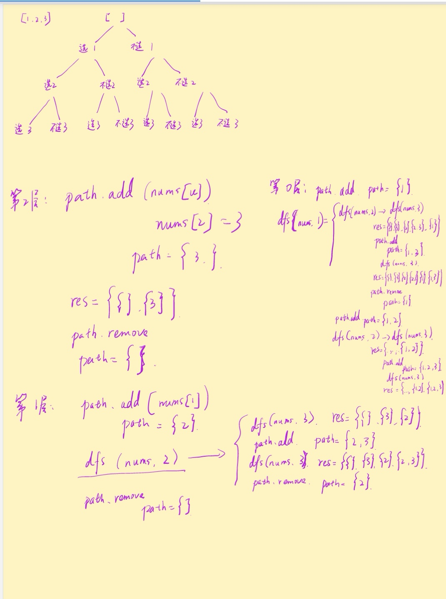

- [如何确定一道题是否应该用【爆搜】来求解](#如何确定一道题是否应该用爆搜来求解)
- [1. 子集 subset I](#1-子集-subset-i)
- [2. 组合总和](#2-组合总和)
- [3. 括号生成](#3-括号生成)
  - [3.1 纯递归](#31-纯递归)
  - [3.2 递归加回溯](#32-递归加回溯)
- [4. 全排列](#4-全排列)

## 如何确定一道题是否应该用【爆搜】来求解
总的来说，你可以从两个方面来考虑：

1. 求的是所有的方案，而不是方案数。 由于求的是所有方案，不可能有什么特别的优化，我们只能进行枚举。这时候可能的解法有动态规划、记忆化搜索、DFS + 回溯算法。

2. 通常数据范围不会太大，只有几十。 如果是动态规划或是记忆化搜索的题的话，由于它们的特点在于低重复/不重复枚举，所以一般数据范围可以出到 10^4到 10^5，而 DFS + 回溯的话，通常会限制在 30 以内。


## 1. 子集 subset I

>leetcode 78

思路：中序遍历，递归
```java
class Solution {
    public List<List<Integer>> subsets(int[] nums) {
        List<List<Integer>> res = new ArrayList<>();
        List<Integer> subset = new ArrayList<>();
        int i = 0;
        res.add(subset);
        inOrder(nums, i, subset, res);
        return res;
    }
    public static void inOrder(int[] nums, int i, List<Integer> subset, List<List<Integer>> res) {
        if (i >= nums.length) return;
        subset = new ArrayList<Integer>(subset);

        inOrder(nums, i + 1, subset, res);
        subset.add(nums[i]);
        // 这里
        res.add(subset);
        inOrder(nums, i + 1, subset, res);
    }

}
```

思路2: 递归，回溯



```java
class Solution {
    List<List<Integer>> res = new ArrayList<List<Integer>>();
    List<Integer> path = new ArrayList<Integer>();
    public List<List<Integer>> subsets(int[] nums) {
        dfs(nums, 0);
        return res;
    }
    public void dfs(int[] nums, int u){
        if (u == nums.length){
            res.add(new ArrayList<Integer>(path)); // ？？
            return;
        }
        dfs(nums, u + 1);
        path.add(nums[u]);
        dfs(nums, u + 1);
        path.remove(path.size() - 1);
    }
}
```
## 2. 组合总和

>leetcode 39

```java
class Solution {
    public List<List<Integer>> combinationSum(int[] candidates, int target) {
        List<List<Integer>> res = new ArrayList<List<Integer>>();
        List<Integer> curres = new ArrayList<Integer>();
        dfs(candidates, 0, target, res, curres);
        return res;
    }
    // candidates 代表原数组
    // index 代表当前执行决策到原数组的哪一位
    // target 代表当前还差多少才能凑成
    // curres 始终表示当前结果
    // res 代表最终结果的集合
    public void dfs(int[] candidates, int index, int target, List<List<Integer>> res, List<Integer> curres){
        // 边界条件，base case，target变为0 的时候结束递归
        if (target == 0){
            res.add(new ArrayList<Integer>(curres));
            return;
        }
        // 极端情况，corner case，target小于0，即没找到组合，数组到最尾了，没满足target，结束递归
        if (index == candidates.length || target < 0){
            return;
        }
        // 枚举这一位数字所有可能的出现次数
        for (int i = 0; candidates[index]*i <= target; i++){
            dfs(candidates, index + 1, target - candidates[index]*i, res, curres);
            curres.add(candidates[index]);
        }
        // 回溯的时候，从curres的最后一个数字开始，循环删除直到该位的所有出现次数。
        for (int i = 0; candidates[index]*i <= target; i++){
            curres.remove(curres.size() - 1);
        }
    }
}
```
## 3. 括号生成

>leetcode 22

### 3.1 纯递归
生成所有可能的序列，不管括号有效还是无效，那么n长度的序列就相当于n-1长度的序列后面加上左括号或者右括号，那么就一共存在2^(2n)种可能性，所有的可能性都找出来以后，边界条件判断一下序列是否有效即可。
```java
class Solution {
    public List<String> generateParenthesis(int n) {
        List<String> combinations = new ArrayList<String>();
        generateAll(new char[2 * n], 0, combinations);
        return combinations;
    }

    public void generateAll(char[] current, int pos, List<String> result) {
        if (pos == current.length) {
            if (valid(current)) {
                result.add(new String(current));
            }
        } else {
            current[pos] = '(';
            generateAll(current, pos + 1, result);// 这个为止和之前做过的一些dfs有些不同，因为两种可能性是覆盖的关系，要么左括号要么右括号，这里是走完了全部是左括号以后，回溯的时候又换右括号。
            current[pos] = ')';
            generateAll(current, pos + 1, result);
        }
    }

    public boolean valid(char[] current) {
        int balance = 0;
        for (char c: current) {
            if (c == '(') {
                ++balance;
            } else {
                --balance;
            }
            if (balance < 0) {
                return false;
            }
        }
        return balance == 0;
    }
}

```


### 3.2 递归加回溯
思路：不枚举所有有效和无效的序列，在序列失效之前回溯，保证枚举的都是有效的序列。我们可以通过跟踪到目前为止放置的左括号和右括号的数目来做到这一点。
如果左括号数量不大于 n，我们可以放一个左括号。如果右括号数量小于左括号的数量，我们可以放一个右括号。

```java
class Solution {
    public List<String> generateParenthesis(int n) {
        List<String> ans = new ArrayList<String>();
        backtrack(ans, new StringBuilder(), 0, 0, n);
        return ans;
    }

    public void backtrack(List<String> ans, StringBuilder cur, int open, int close, int max) {
        if (cur.length() == max * 2) {
            ans.add(cur.toString());
            return;
        }
        if (open < max) {
            cur.append('(');
            backtrack(ans, cur, open + 1, close, max);
            cur.deleteCharAt(cur.length() - 1); // 必须要删掉，因为用的是append，是在序列的尾端加入一个字符，所以要删掉，不然走下个分支的时候再在尾端加右括号，就不是cur这个位置了，是下个位置了。
        }
        if (close < open) {
            cur.append(')');
            backtrack(ans, cur, open, close + 1, max);
            cur.deleteCharAt(cur.length() - 1);
        }
    }
}

```

## 4. 全排列

>leetcode 46

```java
class Solution {
    public List<List<Integer>> permute(int[] nums) {
        List<List<Integer>> res = new ArrayList<List<Integer>>();

        List<Integer> output = new ArrayList<Integer>();
        for (int num : nums) {
            output.add(num);
        }

        int n = nums.length;
        backtrack(n, output, res, 0);
        return res;
    }

    public void backtrack(int n, List<Integer> output, List<List<Integer>> res, int first) {
        // 所有数都填完了
        if (first == n) {
            res.add(new ArrayList<Integer>(output));
        }
        for (int i = first; i < n; i++) {
            // 动态维护数组
            Collections.swap(output, first, i);
            // 继续递归填下一个数
            backtrack(n, output, res, first + 1);
            // 回溯，撤销操作
            Collections.swap(output, first, i);
        }
    }
}
```