# stack and queue
>参考链接 [java栈和队列的实现](http://www.codebaoku.com/it-java/it-java-226198.html) 写的非常全面，稍有改动。

>参考链接 [为什么不推荐使用Stack类实现java栈而是使用Deque](https://mp.weixin.qq.com/s/TSpWaYSUpjeR_wzSclCTQA)

>参考链接 [为什么也不太推荐ArrayDeque实现java栈](https://mp.weixin.qq.com/s/o6gnTbbKUODHBgRD7AYqUQ)

>参考链接 [接口Queue、Deque以及实现他们的类LinkedList和ArrayDeque之间的关系]
- [stack and queue](#stack-and-queue)
  - [1. Implement stack using queues](#1-implement-stack-using-queues)
  - [2. Implement queue using stacks](#2-implement-queue-using-stacks)
  - [3. Min stack](#3-min-stack)
  - [4. 逆波兰表达式](#4-逆波兰表达式)
  - [5. 基本计算器](#5-基本计算器)
  - [6. 括号匹配问题](#6-括号匹配问题)
  - [7. 单调栈问题](#7-单调栈问题)
  - [8. 编码问题](#8-编码问题)

* 总结  
* stack：  
1. 采用链表实现，那就是头插法，头删法，才能保证后进先出或者先进后出。采用链表实现只需要一个head指针即可，采用头插法，头插法有没有哑结点操作都是相同的。  
2. 采用数组实现，尾插尾删，就是正常让数组按head下标不断往后插入，弹出也是直接弹出head下标位置的数，这样就可以实现后进先出，因为head下标始终指向最新进来的哪个数。
* queue：  
1. 采用链表实现，那就是尾插法，头删法，采用两个指针head和tail，才能保证先进先出。尾插法需要区分添加第一个结点的操作和后续的操作。添加第一个结点时需要让tail=newnode，后续添加其他结点时需要tail.next=newnode，tail=tail.next。
2. 采用数组实现，这里需要注意要使用循环队列的形式。具体来讲就是由于我们要实现先进先出，尽管我们可以加两个指针，但是我们在执行弹出操作的时候，始终需要将元素弹出后把后面的所有元素进行移动，以填补弹出造成的空缺。这里就会造成$O(n)$的时间复杂度。要想达到$O(1)$的时间复杂度，就要使用循环数组。即我们采用两个指针，head始终指向已经存放的元素的第一个下标，tail始终指向还未存放（可以存放）的位置的第一个下标。我们假定判断队空的标准是head= tail，那么我们给数组增加一个空位，所以判断队满的标准是（tail+1）% array.length = head。
*  deque：双端队列
1. 采用双向链表实现deque，我们的ListNode里需要增加一个pre指针，指向当前结点的上一个结点。这里我们的操作包括offerFirst，即从左侧向队列添加元素（相当于头插法），offerLast，从右侧向队列添加元素（相当于尾插法）。pollFirst，从左侧头部弹出元素，相当于头删法，pollLast，从右侧尾部弹出元素，相当于尾删法。

## 1. Implement stack using queues
>leetcode 225

请你仅使用两个队列实现一个后入先出（LIFO）的栈，并支持普通栈的全部四种操作（push、top、pop 和 empty）。

思路：  
采用两个以链表为实现的队列，分别为q1，q2。入栈操作时，将元素offer进q2，然后将q1里的元素全部poll出来offer进q2，由于队列采用的时尾插头删法的先进先出，所以此时q2的前端即为最新进栈的元素，然后我们再将q1和q2互换。也就意味着我们要让q2始终为空，我们始终向一个空的队列先offer进一个元素，这个元素是最新进栈的元素，然后把在它之前进栈的从q1安排到q2的它后面，然后把q1和q2互换，让q2始终保持空。前端始终为最新进栈的元素，视为栈顶，后端始终为最先进栈的元素，视为栈底，这样就形成了一个栈。

从而poll和peek的操作也变得非常简单，直接从q1进行pop和peek即可。

```java
class MyStack {
    private Queue<Integer> q1;
    private Queue<Integer> q2;
    public MyStack() {
        q1 = new LinkedList<>();
        q2 = new LinkedList<>();
    }
    
    public void push(int x) {
        q2.offer(x);
        while (!q1.isEmpty()){
            q2.offer(q1.poll());
        }
        Queue<Integer> tmp = q1;
        q1 = q2;
        q2 = tmp;

    }
    
    public int pop() {
        return q1.poll();
    }
    
    public int top() {
        return q1.peek();
    }
    
    public boolean empty() {
        return q1.isEmpty();
    }
}
```
* 复杂度分析
* 时间复杂度：只有push操作时间复杂度是$O(n)$，n代表当前栈内的规模。
* 空间复杂度：$O(n)$，其中n是栈内元素个数，需要两个队列来存储。


## 2. Implement queue using stacks
>leetcode 232

请你仅使用两个栈实现先入先出队列。队列应当支持一般队列支持的所有操作（push、pop、peek、empty）：  
我们是否可以用第一题的方法实现第二题？也就是把栈和队列的身份互换？  
答案是不可以，画图可知。

思路：  
用两个栈实现队列，那么我们将一个栈负责往里push，我们称为s1，另一个栈负责往外pop，称为s2。这里的关键在于，在进行pop和peek操作时，如果s2空了，那么我们需要将s1里面的所有元素push进s2中，这样就可以实现先进先出。而之所以要等s2全部pop空之后再push，是因为如果我们在s2没有空之前将s1里的元素push进去，那么此时s2的栈顶就是最后进队的元素，而不是最先进队的元素。所以一定要等s2里的元素全部被pop出以后，才能把s1里的往s2里push，否则就一直往s1里push即可。


```java
class MyQueue {
    private Deque<Integer> s1;
    private Deque<Integer> s2;
    public MyQueue() {
        s1 = new ArrayDeque<>();
        s2 = new ArrayDeque<>();
    }
    
    public void push(int x) {
        s1.push(x);
    }
    
    public int pop() {
        if (s2.isEmpty()){
            while (!s1.isEmpty()){
                s2.push(s1.pop());
            }   
        }//s2空，就把s1里的全部push进s2，顺序刚好是最先进栈的在栈顶。
        return s2.pop();
    }
    
    public int peek() {
        if (s2.isEmpty()){
            while (!s1.isEmpty()){
                s2.push(s1.pop());
            }   
        }
        return s2.peek();
    }
    
    public boolean empty() {
        return s1.isEmpty() && s2.isEmpty();
    }
}
```
* 复杂度分析
* 时间复杂度：由于所有元素都会被压入栈两次，弹出两次，而一次压入或弹出的复杂度为$O(1)$，因此总的时间复杂度为$O(4n) = O(n)$。
* 空间复杂度：$O(n)$。用了两个栈，两个栈都可能达到n的规模，因此复杂度$O(2n)$。

## 3. Min stack
>leetcode 155
设计一个支持 push ，pop ，top 操作，并能在常数时间内检索到最小元素的栈。 

思路：  
* 采用外加一个辅助栈的方式实现，每当我们向原栈中push进一个元素，我们都要往辅助栈中push进一个当前原栈中的最小元素。因此我们要记录一下当前原栈中的最小元素。当我们pop的时候，我们需要同步从辅助栈中pop出栈顶元素，从而让我们的辅助栈栈顶始终保持着当前原栈中的最小元素。如果只同步push而不同步pop，那么辅助栈的栈顶元素会是所有曾经push进原栈的数据的最小元素而不是当前原栈的。
* 
```java
class Minstack {
    Deque<Integer> xStack;
    Deque<Integer> minStack;
    public Minstack(){
        xStack = new LinkedList<Integer>();
        minStack = new LinkedList<Integer>();
    }
    public void push(int val){
        xStack.push(val);
        minStack.push(Math.min(minStack.peek(),val));
    }
    public void pop(){
        xStack.pop();
        minStack.pop();
    }
    public int top(){
        return xStack.peek();
    }
    public int getMin(){
        return minStack.peek();
    }
}
```
* 复杂度分析
* 时间复杂度：$O(1)$，因为我们每个操作都是$O(1)$时间，push，pop，getMin都是$O(1)$时间。
* 空间复杂度：$O(n)$，因为要用两个栈存储数据，两个栈的规模都可以达到n，n代表我们要push进的数据规模。

## 4. 逆波兰表达式
逆波兰表达式又称为后缀表达式
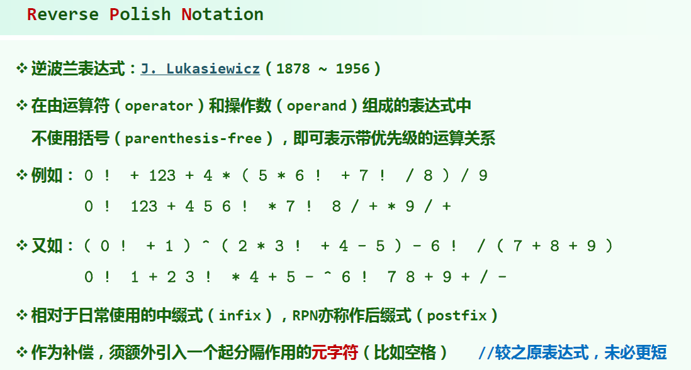
思路：在求解逆波兰表达式的时候，我们可以使用栈来解决，遍历整个字符串，一旦遇到数字，就让数字入栈，一旦碰到操作符，就把顶的两个元素拿出来进行运算，将运算结果再压入栈中。这里需要额外注意的一点是，拿出来的两个数字一定是栈顶数字作为第二个操作数位于操作符之后。
```java
class Solution {
    public int evalRPN(String[] tokens) {
        Deque<Integer> stack = new LinkedList<Integer>();
        int n = tokens.length;
        for (int i = 0; i < n; i ++){
            String token = tokens[i];
            if (isNumber(token)) {
                stack.push(Integer.parseInt(token));// 将字符转变为十进制数的函数
            }
            else {
                int num2 = stack.pop();
                int num1 = stack.pop();
                switch (token) { // 这里采用 switch判断操作符怎么进行计算。
                    case "+":
                        stack.push(num1 + num2);
                        break;
                    case "-":
                        stack.push(num1 - num2);
                        break;
                    case "*":
                        stack.push(num1 * num2);
                        break;
                    case "/":
                        stack.push(num1 / num2);
                        break;
                }
            }
        }
        return stack.peek();
    }
    public boolean isNumber(String token) {
        return !("+".equals(token) || "-".equals(token) || "*".equals(token) || "/".equals(token));//自写判断字符是不是数字的方法。
    }

}
```

## 5. 基本计算器
给你一个字符串表达式 s ，请你实现一个基本计算器来计算并返回它的值。  
思路：  
1. 使用两个栈，stack0用于存储操作数，stack1用于存储操作符。
2. 从左往右扫描，遇到操作数入栈stack0。
3. 遇到操作符时，如果当前优先级低于或等于栈顶操作符优先级，则从stack0弹出两个元素，从stack1弹出一个操作符（这里弹出的这个操作符是当前我们扫描到的操作符的上一个操作符，位于stack1栈顶），进行计算，将结果压入stack0，继续与栈顶操作符比较优先级。
4. 如果遇到操作符高于栈顶操作符优先级，则直接入栈stack1，操作符优先级高意味着它需要在上一个操作符之前进行计算，因此先将其压入栈中。
5. 遇到左括号，直接将左括号入栈stack1，因为括号的优先级最高。
6. 遇到右括号，则从stack0弹出两个元素，从stack1弹出一个操作符进行计算，并将结果加入到stack0中，重复这一直到遇到左括号。

这算法的思路就在于，碰到数字直接压进数字栈，碰到运算符，由于这里不涉及优先级问题，加减属于同一优先级，所以我们直接弹出上一个运算符和两个数进行运算把结果再放进数字栈里。这里的问题就在于括号的出现，左括号一出现，直接放进栈里，先不运算，直到碰到括号里的运算符，再重复运算符那个分支的计算（即弹出上一个运算符和两个数进行运算再把结果放进数字栈里），这里要注意判断运算符的上一个操作符是不是左括号，如果是左括号，代表我们现在这个运算符是括号内的第一个运算符，不进行计算，从括号内的第二个运算符开始我们再进行计算，这时我们直接弹出第一个运算符和两个数，计算。如果遇到了右括号，那么此时此刻只有两种情况，要么括号内有多个运算符，遇到右括号时被我们计算的只剩下一个操作符和两个数了（因为我们碰到运算符就会走运算符分支代码进行计算），我们直接计算即可，要么我们括号内一开始就只有一个运算符，然后就遇到了右括号，这时我们就也直接弹出运算符和两个数，直接进行运算。还要注意整个式子的开头如果是负数，那么我们需要在开头添加一个0放在数字栈里，以及左括号后面一开始是负数，也要在负数前面先加个0，不然还有这种边界情况要判断。
```java
class Solution {
    public int calculate(String s) {
        char[] array = s.toCharArray();
        int n = array.length;
        Stack<Integer> num = new Stack<>();
        Stack<Character> op = new Stack<>();
        num.push(0);// 为防止一开始就是一个负数，我们需要在num栈开头push进一个0，以防止边界的判断。
        int temp = -1;
        for (int i = 0; i < n; i++) {
            if (array[i] == ' ') {
                continue;
            }
            // 数字进行累加
            if (isNumber(array[i])) {
                if (temp == -1) {
                    temp = array[i] - '0';
                } else {
                    temp = temp * 10 + array[i] - '0';
                }
            } else {
                //将数字入栈
                if (temp != -1) {
                    num.push(temp);
                    temp = -1;
                }
                //遇到操作符
                if (isOperation(array[i] + "")) {
                    while (!op.isEmpty()) {
                        if (op.peek() == '(') {
                            break;
                        }
                        //不停的出栈，进行运算，并将结果再次压入栈中
                        int num1 = num.pop();
                        int num2 = num.pop();
                        if (op.pop() == '+') {
                            num.push(num1 + num2);
                        } else {
                            num.push(num2 - num1);//减法要注意两个数字的位置。
                        }

                    }
                    //当前运算符入栈
                    op.push(array[i]);
                } else {
                    //遇到左括号，直接入栈
                    if (array[i] == '(') {
                        if (array[i+1] == '-'){
                            num.push(0);
                        }
                        op.push(array[i]);
                        //num.push(0);
                    }
                    //遇到右括号，不停的进行运算，直到遇到左括号
                    if (array[i] == ')') {
                        while (op.peek() != '(') {
                            int num1 = num.pop();
                            int num2 = num.pop();
                            if (op.pop() == '+') {
                                num.push(num1 + num2);
                            } else {
                                num.push(num2 - num1);
                            }
                        }
                        op.pop();
                    }

                }
            }
        }
        if (temp != -1) {
            num.push(temp);
        }
        //将栈中的其他元素继续运算
        while (!op.isEmpty()) {
            int num1 = num.pop();
            int num2 = num.pop();
            if (op.pop() == '+') {
                num.push(num1 + num2);
            } else {
                num.push(num2 - num1);
            }
        }
        return num.pop();
    }

    private boolean isNumber(char c) {
        return c >= '0' && c <= '9';
    }

    private boolean isOperation(String t) {
        return t.equals("+") || t.equals("-") || t.equals("*") || t.equals("/");
    }
}
```
复杂度分析：
* 时间复杂度：有一个for循环，复杂度$O(n)$
* 空间复杂度：两个栈，复杂度$O(n)$

## 6. 括号匹配问题

>leetcode 20

给定一个只包括 '('，')'，'{'，'}'，'['，']' 的字符串 s ，判断字符串是否有效。

有效字符串需满足：

左括号必须用相同类型的右括号闭合。
左括号必须以正确的顺序闭合。

思路：遇到左括号直接入栈，如果遇到右括号，则需要对比栈顶元素是否是相应的左括号，如果不是或者栈空，返回false，如果匹配上了，则直接将栈顶元素弹出。最后检查下栈是否为空，返回一个return stack.isEmpty()，因为如果全部匹配成功，最终应该所有的左括号全部出栈，栈应该为空，如果不为空，则代表还有未匹配上的左括号。  
```java
class Solution {
    public boolean isValid(String s) {
        int n = s.length();
        if (n % 2 == 1) {
            return false;
        }

        Map<Character, Character> pairs = new HashMap<Character, Character>() {{
            put(')', '(');
            put(']', '[');
            put('}', '{');
        }};//用一个hashmap来储存键值对，不然需要挨个判断比较麻烦。
        Deque<Character> stack = new LinkedList<Character>();
        for (int i = 0; i < n; i++) {
            char ch = s.charAt(i);
            if (pairs.containsKey(ch)) {
                if (stack.isEmpty() || stack.peek() != pairs.get(ch)) {
                    return false;
                }//遇到右括号，查看栈顶元素是否匹配，栈是否空
                stack.pop();
            } else {
                stack.push(ch);
            }
        }
        return stack.isEmpty();//最后检查是否栈空

    }
}
```
>leecode 921
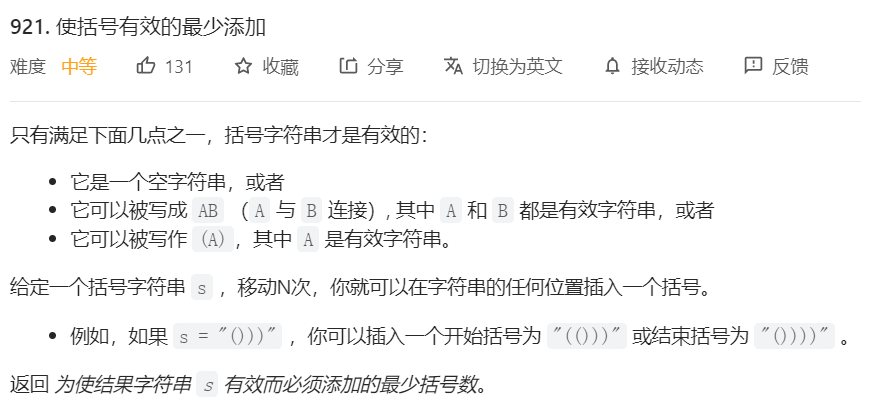
怎样让一个括号字符串变为有效括号字符串，需要至少加几个左括号或者右括号？  
思路：我们只要把能匹配到的每一对都剔除掉，剩下的没匹配到的，也就是需要添加的个数。  
怎样剔除？用一个栈，碰到左括号，进栈，碰到右括号，弹出栈顶的一个左括号，如果栈顶不是左括号或者栈空，说明能弹出的左括号已经全部弹出了，那么此时直接将右括号入栈即可，说明没有可匹配的左括号，需要另外匹配。
```java
class Solution {
    public int minAddToMakeValid(String s) {
        Deque<Character> stack = new ArrayDeque<Character>();
        for (int i = 0; i < s.length(); i++){
            char ch = s.charAt(i);
            if (ch == ')'){
                if (stack.isEmpty() || stack.peek() != '('){
                    stack.push(ch);
                } 
                else {
                    stack.pop();
                }
            }
            else {
                stack.push(ch);
            }
            
        }
        return stack.size();
    }
}
```

>leetcode 1021
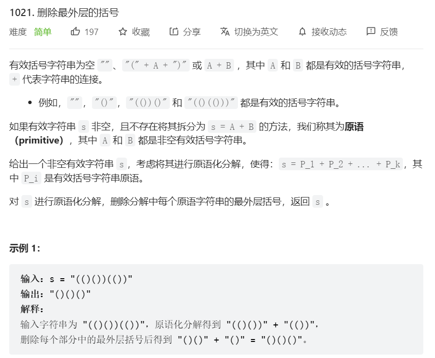

主要是理解一下原语，就是不能再拆分的有效括号字符串，所谓有效括号字符串，就是每一个右括号都有相应的左括号进行匹配。

思路：使用栈来解决，遇到左括号进栈，遇到右括号出栈，现在的特性就是，如果遇到一段原语，那么等到扫描到这段原语最后一个右括号时，执行出栈操作，此时栈空，因为相匹配的左括号已经全部出栈。由于这里我们要去掉每一段原语的最外层括号，所以只要等到栈空的那一刻，我们把最左侧括号+1的位置到最右侧括号-1的位置的字符串append到一个可变字符串StringBuilder变量的后面即可。
```java
class Solution {
    public String removeOuterParentheses(String s) {
        Stack<Integer> stack = new Stack<>();
        StringBuilder ret = new StringBuilder();
        for (int i = 0; i < s.length(); i++) {
            if (s.charAt(i) == '(') stack.push(i);//这里我们送进栈里的是字符所对应的下标，方便之后的拼接操作。
            else {
                int index = stack.pop();
                if (stack.empty()) {
                    ret.append(s.substring(index + 1, i));
                }
            }
        }
        return ret.toString();
    }
}
```

## 7. 单调栈问题

>leetcode 84


>leetcode 456

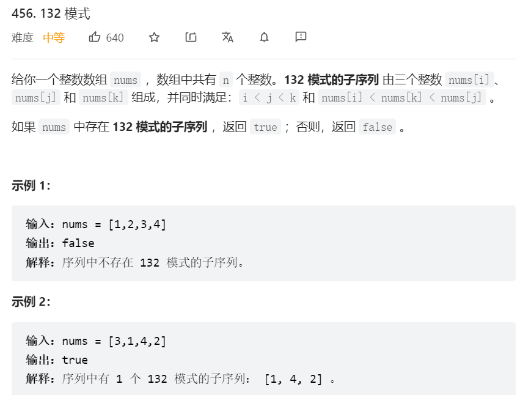
思路：   
在132模式中，3是最大值，但下标位置处于中间，也就是我们要找是否存在132模式的序列，我们就可以枚举一下3，同时我们希望找到3右侧的小于3的最大元素，和左侧小于3的最小元素，这样才最有希望找到132模式序列，最后我们把1和2比较一下看是否满足，如果满足1小于2，那么就存在132序列，反之不存在。  
现在的问题是，我们在枚举3的同时，怎样确定3左侧的小于3的最小值以及3右侧的小于3的最大值？

3左侧的小于3的最小值可以通过遍历一次得到，3右侧的小于3的最大值，我们从右往左维护一个单调栈，nums[i]大于栈顶元素，把小于num[i]的栈顶元素全部弹出，记录一下最后一次弹出的元素，即为3右侧的小于3的最大元素。

```java
class Solution {
    public boolean find132pattern(int[] nums) {
        int n = nums.length;
        Deque<Integer> stack = new ArrayDeque<Integer>();
        stack.push(nums[n - 1]);
        int maxK = Integer.MIN_VALUE;
        for (int i = n-2; i >= 0; i--){
            if (nums[i] < maxK){
                return true;// 这里我们没有去构造一个左侧的最小值数组，我们在从右往左遍历的过程中，储存了maxK
                //所以只要当前遍历到的元素比maxK小即可满足132模式
                //而maxK会随着i左移不断更新。
            }
            while (!stack.isEmpty() && nums[i] > stack.peek()){
                maxK = stack.pop();
            }
            stack.push(nums[i]);// 这里其实应该判断一下，只有在nums[i]大于maxK的时候才可以push，但其实等于的时候也没关系，但等于的时候push会破坏我们栈的单调性。
        }
        return false;
    }
}
```


>leetcode 496
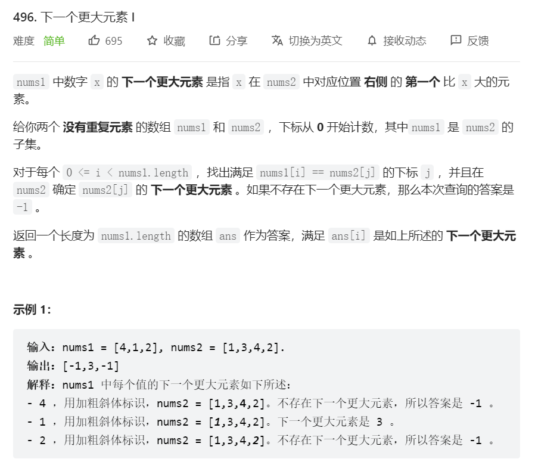

思路：单调栈+哈希表。我们维护一个单调栈，从数组的尾部开始，记录当前数组元素的右端第一个更大的值，也就是说，栈顶始终是当前元素右端第一个更大的值。怎样实现？一旦我们当前元素比栈顶的元素大，那我们就把栈顶元素pop出来，循环比较，小于当前元素的全部pop出来，然后把剩下的栈顶元素作为当前元素右端第一个更大的值，和当前元素一起作为键值对储存在哈希表中，最后再将当前元素push进栈，当然也有可能循环比比较pop完之后栈空了，那么我们就在储存键值对的时候对相应的查找键储存一个-1值，不空就储存栈顶值。
```java
class Solution {
    public int[] nextGreaterElement(int[] nums1, int[] nums2) {
        Map<Integer, Integer> map = new HashMap<Integer, Integer>();
        Deque<Integer> stack = new ArrayDeque<Integer>();
        for (int i = nums2.length - 1; i >= 0; i--){
            int num = nums2[i];
            while (!stack.isEmpty() && num >= stack.peek()){
                stack.pop();
            }
            map.put(num, stack.isEmpty() ? -1 : stack.peek());
            stack.push(num);
        }
        int[] res = new int[nums1.length];
        for (int i = 0; i < nums1.length; i++){
            res[i] = map.get(nums1[i]);
        }
        return res;
    }
}
```
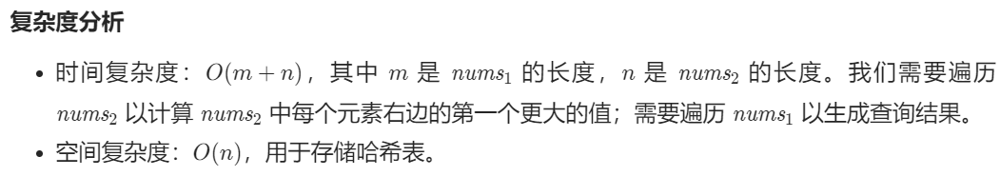

>leetcode 503

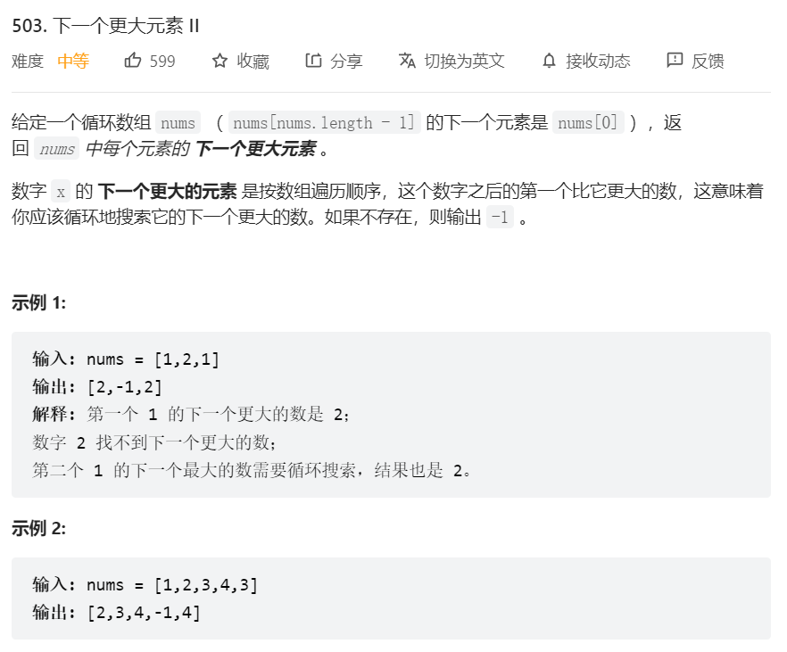
思路：用单调栈加循环数组展平。我们用一个栈来储存数组下标，只要我们发现当前nums[i]的值大于栈顶储存的下标位置的数组元素，那么我们就将栈内所有小于nums[i]的下标全部弹出，且这些下标位置元素的下一个更大的值都是nums[i]，很好证明，因为加入在nums[i]之前还有更大的值，那么他们早就被弹出了。
此时直到最后一个元素，我们无法找到在它右端的比他更大的数了，我们可以展平数组，即将循环数组最后元素前面的那部分复制一下到最后一个元素后面。这里我们可以不通过复制解决，直接通过对下标取模，还方便我们对结果数组的索引。
```java
class Solution {
    public int[] nextGreaterElements(int[] nums) {
        int n = nums.length;
        int[] res = new int[n];
        Arrays.fill(res,-1); // 对于那些无法找到更大的值的位置，我们以-1代替。
        Deque<Integer> stack = new ArrayDeque<Integer>();
        for (int i = 0; i < 2 * n - 1; i++){// 循环数组展平后的下标范围是0到2*n - 2。
            while (!stack.isEmpty() && nums[i % n] > nums[stack.peek()]){
                res[stack.pop()] = nums[i % n];
            }
            stack.push(i % n);// 我们对下标取模，使我们栈内的下标始终在0到n-1的范围内
            //之后我们对res数组进行索引赋值的时候，有可能会对相同位置的再重复赋值一次，但结果不变，所以比较方便
            //这也是我们为什么要在栈里储存下标而不是数组元素
        }
        return res;
    }
}
```
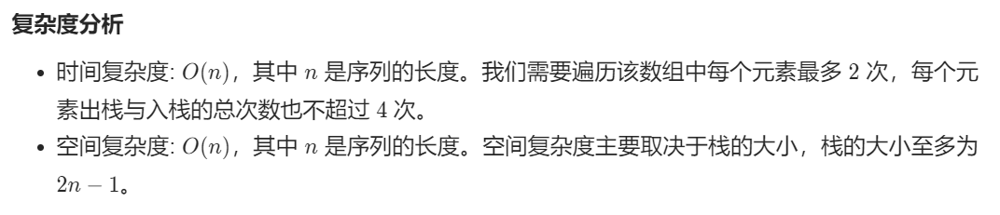

## 8. 编码问题

>leetcode 394
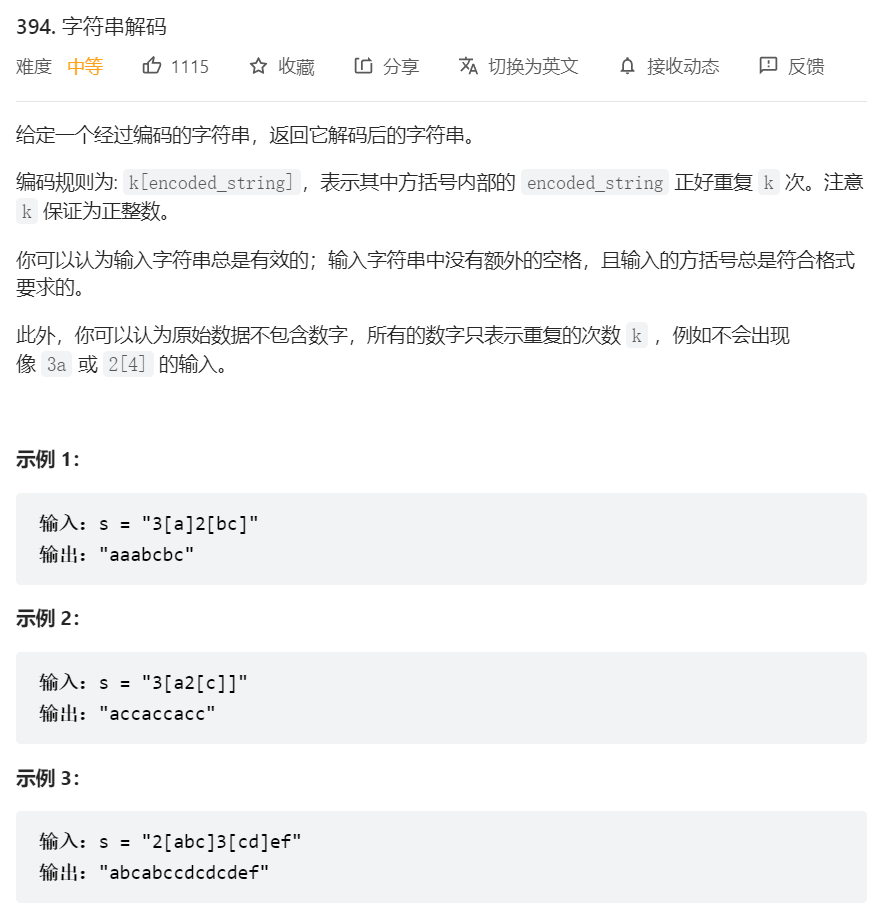
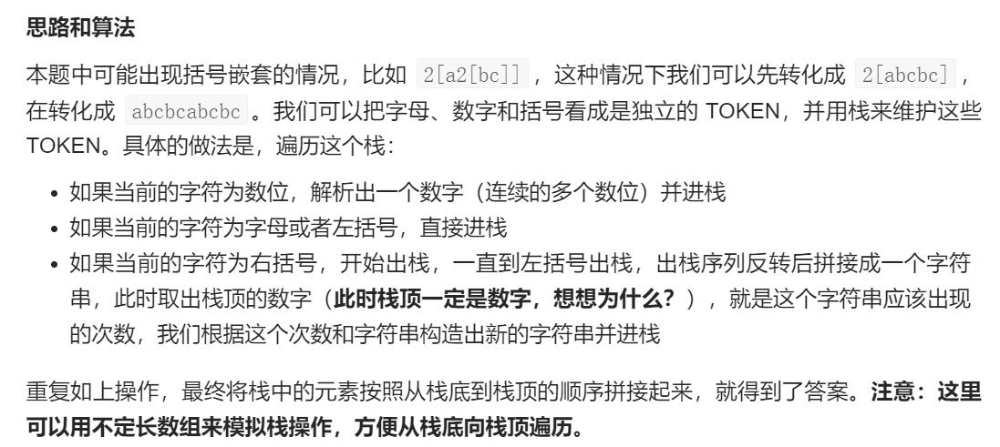

```java
class Solution {
    int ptr; // ptr是全局变量，会在多个方法中使用，并且保证在每个调用方法的位置都是当前的ptr。

    public String decodeString(String s) {
        ptr = 0;
        LinkedList<String> stk = new LinkedList<String>();// 采用链表作为可变长数组，模拟栈操作，而且链表中元素类型是String，即我们直接保存String变量
        int n = s.length();
        while (ptr < n){
            char cur = s.charAt(ptr);
            if (Character.isDigit(s.charAt(ptr))){
                String digits = getDigits(s); // 这里getDigits方法最好返回String变量，因为我们要将其入栈，栈是String类型的链表。
                stk.addLast(digits);// 模拟栈的push
                //这里不需要再将ptr后移，因为getdigits方法已经将ptr后移到数字的下一位
            }
            else if (Character.isLetter(cur) || cur == '['){// 遍历到左括号或者字母，直接进栈
                stk.addLast(String.valueOf(cur));
                ptr ++;
            }
            else {//遍历到右括号
                ptr ++;
                LinkedList<String> sub = new LinkedList<String>(); // 使用另一个链表，存储单个括号内的字符串，方便我们进行复制重组
                while (!"[".equals(stk.peekLast())){
                    sub.addLast(stk.removeLast());
                }// 模拟栈，把stk的栈顶元素全部pop到sub里，碰到左括号后停止循环。注意这里比对String变量需要用equals方法，不能直接比。
                Collections.reverse(sub);// 反转链表，因为从栈里pop出来的是反序。
                stk.removeLast(); // 把左括号也出栈
                int repTime = Integer.parseInt(stk.removeLast()); // 把字符串转变为十进制整数
                StringBuffer t = new StringBuffer(); // 使用StringBuffer类，作为可变长度的字符数，进行拼接操作，然后再转为String这种不可变长的字符串。
                String o = getString(sub);
                while (repTime > 0){
                    t.append(o);
                    repTime --;
                }
                stk.addLast(t.toString());// 把重复好的一个括号内的字符串入栈，这是之前没想到的点，相当于把内层括号去掉的效果，只有入栈后，才能保证我们操作的统一性。toString方法，用于StringBuffer类转变为String。
            }
        }
        return getString(stk); // 最后栈里会剩一个括号内的和括号外的，或者两个括号内的，最后我们只要使用getString方法把栈内的字符串拼接即可。
    }

    private String getDigits(String s){
        StringBuffer t = new StringBuffer();
        while (Character.isDigit(s.charAt(ptr))){
            t.append(s.charAt(ptr));
            ptr ++;
        }
        return t.toString();
    }
    private String getString(LinkedList<String> l){
        StringBuffer t = new StringBuffer();
        for (String s : l){
            t.append(s);
        }
        return t.toString();
    }
        
}
```
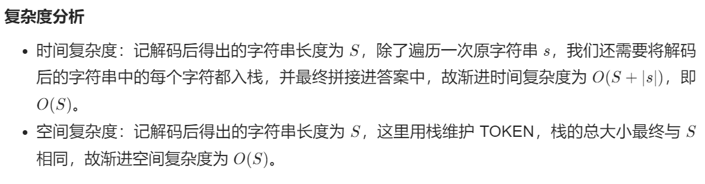