# Tree
- [Tree](#tree)
  - [1. 利用栈和队列实现二叉树遍历的非递归算法](#1-利用栈和队列实现二叉树遍历的非递归算法)
  - [2. 二叉树的中序遍历](#2-二叉树的中序遍历)
  - [3. same tree](#3-same-tree)
  - [4. 树是否对称](#4-树是否对称)
  - [5. 递归、栈、队列、空间复杂度](#5-递归栈队列空间复杂度)
  - [6. 二叉树最大深度](#6-二叉树最大深度)
  - [7. 二叉树层序遍历](#7-二叉树层序遍历)
  - [8. 二叉树层序遍历II](#8-二叉树层序遍历ii)
  - [9. 二叉树后序遍历](#9-二叉树后序遍历)
  - [10. 二叉树前序遍历](#10-二叉树前序遍历)
  - [11. 二叉树最小深度](#11-二叉树最小深度)
  - [12. 平衡二叉树](#12-平衡二叉树)
  - [13. 有序数组转换为高度平衡的二叉搜索树](#13-有序数组转换为高度平衡的二叉搜索树)
  - [14. 二叉树的所有路径](#14-二叉树的所有路径)
  - [15. lowest common ancestor I](#15-lowest-common-ancestor-i)
  - [16. lowest common ancestor II](#16-lowest-common-ancestor-ii)
  - [17. lowest common ancestor III](#17-lowest-common-ancestor-iii)
  - [18. lowest common ancestor IV](#18-lowest-common-ancestor-iv)
  - [19. lowest common ancestor V](#19-lowest-common-ancestor-v)
  - [20. lowest common ancestor VI](#20-lowest-common-ancestor-vi)
  - [21. 路径总和](#21-路径总和)
  - [22. 反转二叉树](#22-反转二叉树)
  - [23. 任意两个结点之间的最大路径和](#23-任意两个结点之间的最大路径和)
  - [24. 任意两个叶结点之间的最大路径和](#24-任意两个叶结点之间的最大路径和)
  - [25. leaf 到任一祖宗结点的最大路径和](#25-leaf-到任一祖宗结点的最大路径和)
  - [26. 单边root to leaf](#26-单边root-to-leaf)
  - [27. 路径总和II](#27-路径总和ii)
  - [28. 路径总和III](#28-路径总和iii)
  - [29. 最大二叉树](#29-最大二叉树)
  - [30. 二叉搜索树的第k小元素](#30-二叉搜索树的第k小元素)
## 1. 利用栈和队列实现二叉树遍历的非递归算法
树的前中后序遍历既可以用简单的递归来实现，也可以用栈来实现非递归的算法。  
普遍思路就是把目前无法访问的结点放入栈中，而后再退栈访问。  
* 先看前序遍历：
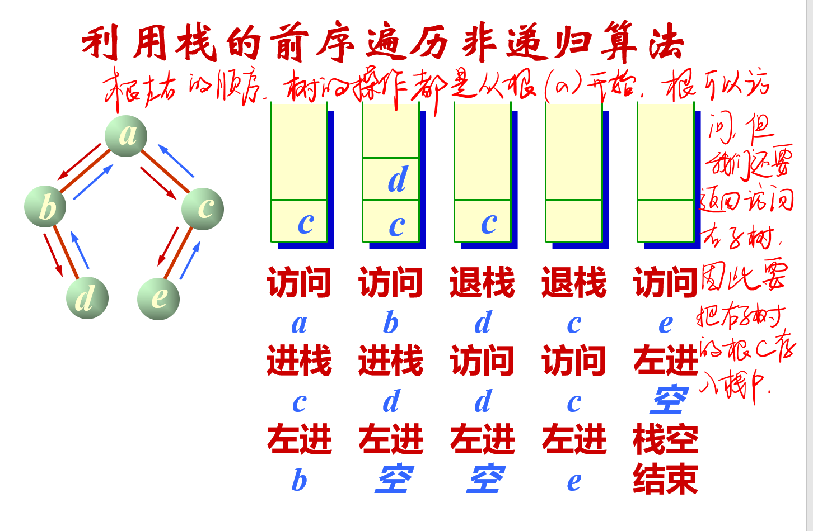
前序遍历是根左右的顺序，访问a，访问b，都可以访问，但访问a的时候我们要将a的右孩子c入栈，因为此时c无法被访问，之后我们还需要返回访问右子树。同理，访问b的时候要将b的右孩子d入栈，因为访问
b的时候d无法被访问。  
* 总体思路：非递归写法，while循环，先visit当前结点，如果右孩子不为空，将右孩子入栈，如果左孩子不为空，直接将指向当前结点的指针指向左孩子，如果左孩子为空，直接从栈顶弹出一个结点并把这个结点当作当前结点继续进循环。  
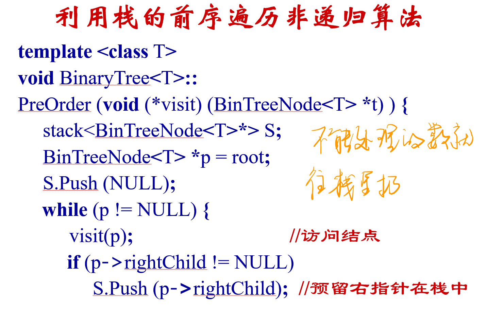
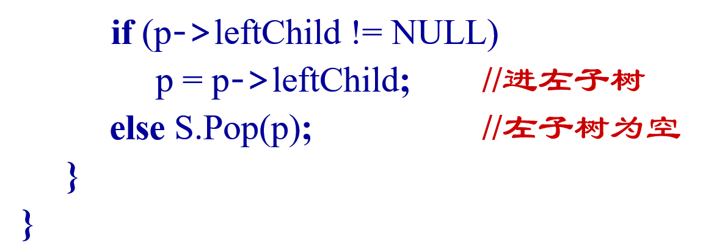

* 中序遍历：  
  利用栈实现中序遍历的非递归算法，总体思路还是要把暂时无法访问处理的结点入栈。 
  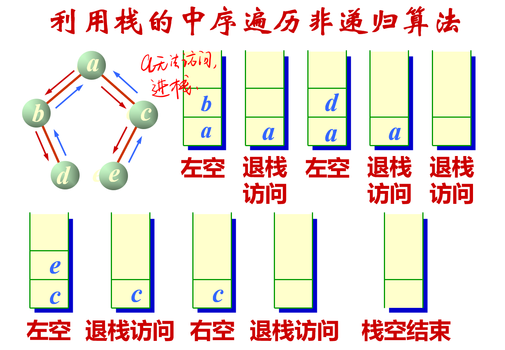
中序遍历，左根右，访问a时，a无法访问，进栈，进而访问b，b无法访问，进栈，进而访问b左孩子，b左孩子为空，退栈，访问b，访问b的时候b的右孩子d无法访问，d入栈，p指针指向d的左孩子，d的左孩子为空，即p为空，则退栈，访问退栈的结点d，p移向退栈结点d的右孩子，d的右孩子为空，p为空，退栈，访问退栈的结点a，p移向退栈结点的右孩子c，右孩子c不为空，进栈。只要栈不空，重复这个过程。
  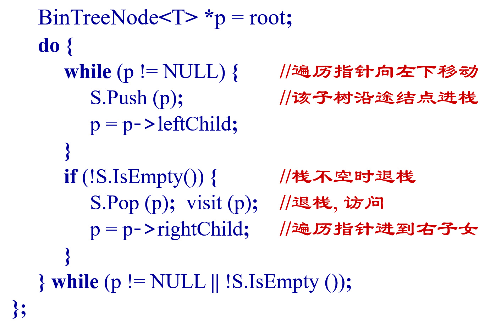
* 后序遍历：  
  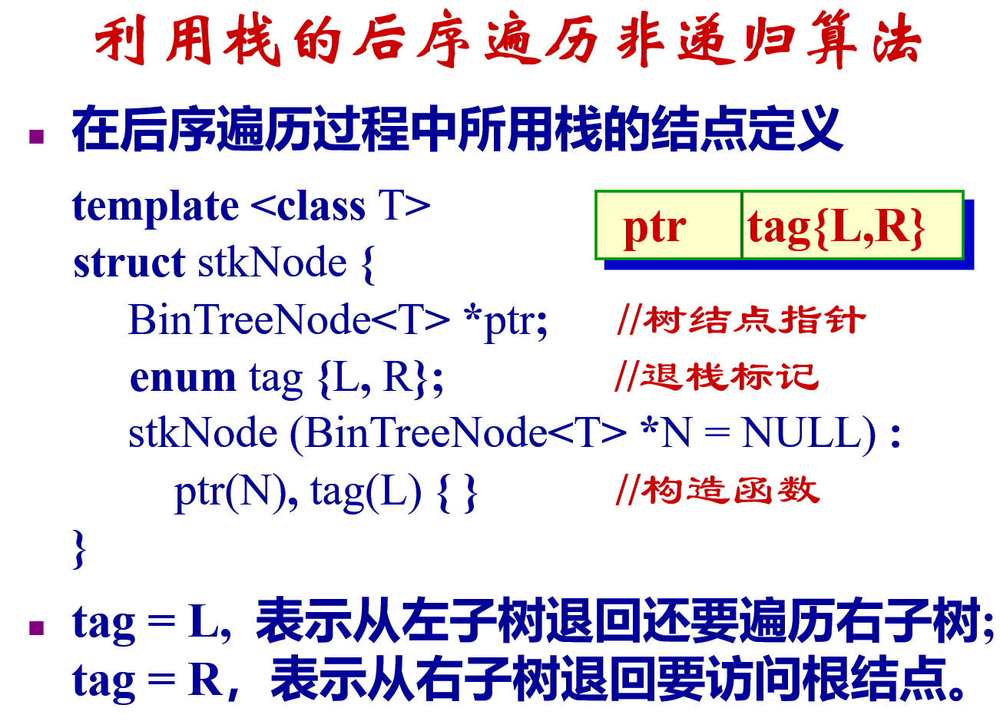
  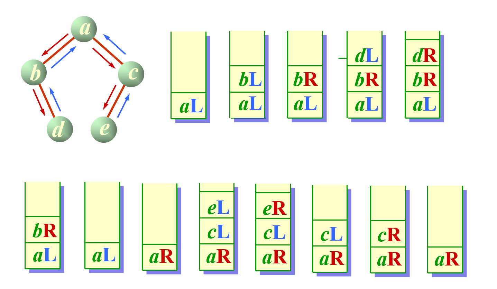
  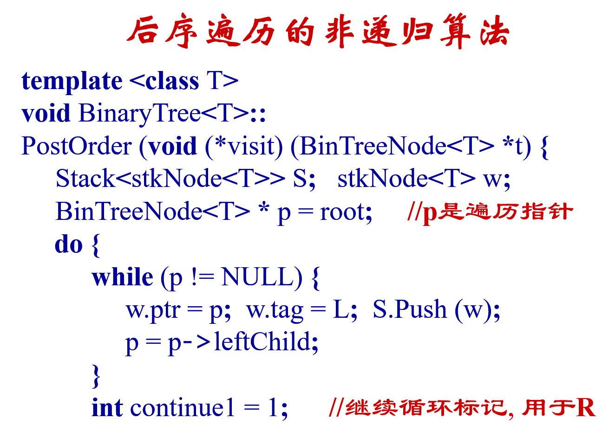
  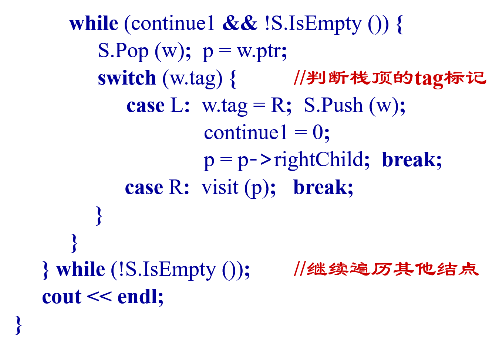

* 用队列实现层序遍历：
  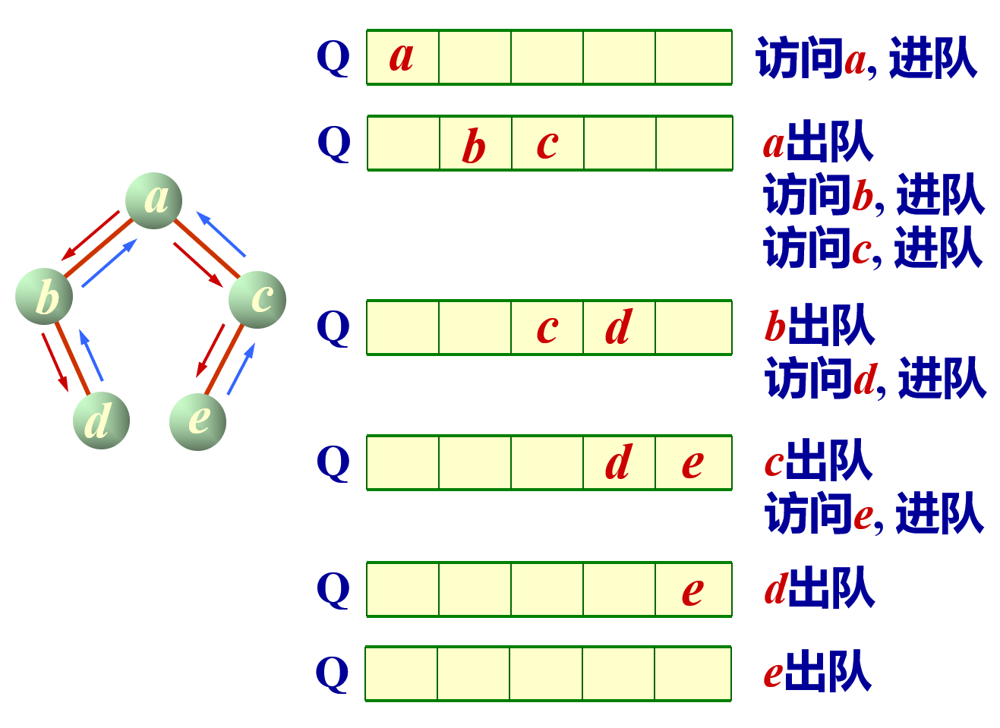
  ```c++
  template <class T>
     void BinaryTree<T>::levelOrder (void (*visit)     (BinTreeNode<T> *t)) {
     if (root == NULL) return;
     Queue<BinTreeNode<T> * > Q;
     BinTreeNode<T> *p = root;   
     visit (p);   Q.EnQueue (p); 	
     while (!Q.IsEmpty ()) {
          Q.DeQueue (p);
          if (p->leftChild != NULL) { 
              visit (p->leftChild);
               Q.EnQueue (p->leftChild);
          }
          if (p->rightChild != NULL) {
               visit (p->rightChild);
               Q.EnQueue (p->rightChild);
          }
     }
  }
  ```
## 2. 二叉树的中序遍历
>leetcode 94  

简单的中序遍历，使用学过的递归算法即可解决。
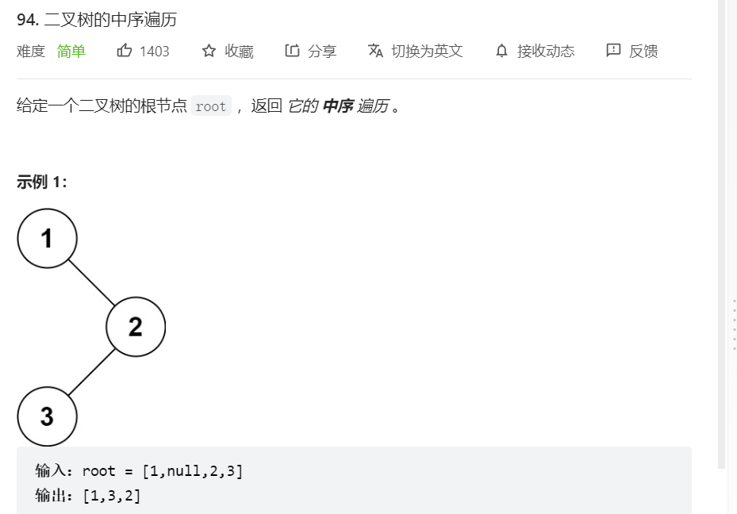
思路：递归
```java
class Solution {
    public List<Integer> inorderTraversal(TreeNode root) {
        List<Integer> res = new ArrayList<Integer>();
        getAns(res, root);//这里需要注意我们输出的是一个可变数组表arraylist，我们在方法内部构建了这样一个对象
        // 那么我们就不能再用递归直接递归本函数，因为这个对象会被重新例化，我们不需要重新例化，因此这里用另一个函数进行递归，保证arraylist对象不被重新例化。
        return res;
    }
    public void getAns(List<Integer> res, TreeNode root){
        if (root == null){
            return;
        }
        getAns(res,root.left);
        res.add(root.val);
        getAns(res,root.right);
    }
}
```
* 复杂度分析  
  时间复杂度：$O(n)$，每个结点遍历一次，递归树方法画一下，每层全部加起来就是所有结点的数量。分治法的divide和merge复杂度是$O(1)$。
  空间复杂度：$O(n)$，取决于递归的栈深度，最差情况就是二叉树一条链，总共压栈n次。

```java
class Solution{
    public List<Integer> inorderTraversal(TreeNode root){
        List<Integer> res = new ArrayList<>();
        if(root == null){
            return res;
        }
        TreeNode helper = root;
        Deque<Integer> stack = new ArrayDeque<>();
        //stack.offerFirst(root);
        while (helper != null || !stack.isEmpty()){
            if (helper != null){
                stack.offerFirst(hellper);
                helper = helper.left;
            }
            else {
                helper = stack.pollFirst();
                res.add(helper.val);
                helper = helper.right;
            }

        }
        return res;
    }
}
```
iterative zyz:
```java
public class Solution {
    public List<Integer> inOrder(TreeNode root) {
        List<Integer> result = new ArrayList<>();
        TreeNode helper = root;
        if(root == null){
            return result;
        }
        Deque<TreeNode> stack = new ArrayDeque<>();
        while(helper != null || !stack.isEmpty()){
            if(helper != null){
                stack.offerFirst(helper);
                helper = helper.left;
            }
            else{
                helper = stack.pollFirst();
                result.add(helper.key);
                helper = helper.right;
            }
        }
        return result;
    // Write your solution here
    }
}
```

## 3. same tree
>leetcode 100 

判断两个树是否完全一样。
思路：递归遍历。
```java
class Solution {// 注意一下递归的写法，递归中止条件在哪，if else elseif 怎么使用， return的位置等，别绕进去。
    public boolean isSameTree(TreeNode p, TreeNode q) {
        if (p == null && q == null){
            return true;
        }
        else if (p == null || q == null){
            return false;
        }
        if (isSameTree(p.left, q.left) && isSameTree(p.right, q.right) && (p.val == q.val)){
            return true;
        }
        return false;
    }
}
```

## 4. 树是否对称
>leetcode 101

思路：递归，判断树是否对称，就是判断树的左右子树是否对称，即子问题为左子树的左子树是否等于右子树的右子树，左子树的右子树是否等于右子树的左子树，满足了这两个条件，这棵树就是对称的。

```java
class Solution {
    public boolean isSymmetric(TreeNode root) {
        TreeNode p = root.left;
        TreeNode q = root.right;
        return isEqual(p, q);

    }
    public boolean isEqual(TreeNode p, TreeNode q){
        if (p == null && q == null){
            return true;
        }
        else if (p == null || q == null){
            return false;
        }
        else {
            return isEqual(p.left, q.right)&&isEqual(p.right, q.left)&&(p.val == q.val); // 关键在于p.left要和q.right比较，而p.right要和q.left进行比较。
        }
    }
}
```
## 5. 递归、栈、队列、空间复杂度

* 递归和栈的关系：每一次递归调用，或者函数调用时，需要为过程中使用的参数，局部变量等另外分配存储空间，每层递归调用需分配的空间形成递归工作记录，按后进先出的栈组织。
* 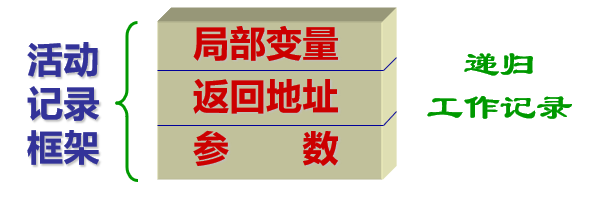
* 在递归过程中，碰到无法解决的子问题，先将子问题进栈，直到递归边界，回溯时从栈顶依次出栈。
* 涉及到递归算法的空间复杂度要看压栈的规模，在二叉树的递归算法中，如中序遍历，最差空间复杂度是二叉树一条链的情况，此时我们的递归深度就是这条链的长度。但假如是满二叉树的情况，我们的递归深度其实只有树的高度$log(n)$大小，因为我们其实在递归左子树的时候一直沿左子树往下，下到叶节点，中途压栈的都是左节点的递归，递归回溯的时候就开始退栈了，所以栈的规模始终不超过$log(n)$。
* 栈是深度优先，队列是广度优先。从上面采用栈实现前中后序遍历，使用队列实现层序遍历即可知道。
* 递归的结构:corner case,即递归的极端情形，如空值null；base case，递归的基准情形，即递归的终止条件，如要求n的阶乘，那我们最终在哪里停止呢，这时我们就要定义一个基准，也就是终止条件，即0的阶乘等于1；recursion rule，递归规律，也就是如何自己调用自己。
* 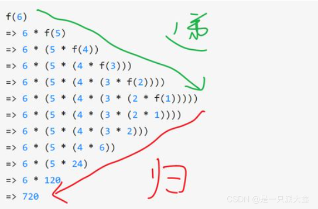
* 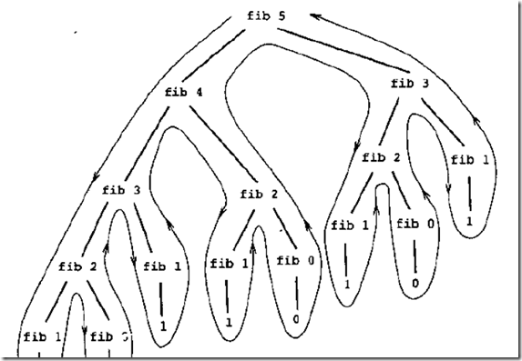

## 6. 二叉树最大深度
>leetcode 104

```java
class Solution{
    public int maxDepth(TreeNode root){
        if (root == null){
            return 0;
        }
        int maxLeft = maxDepth(root.left);
        int maxRight = maxDepth(root.right);
        return Math.max(maxLeft,maxRight)+1;
    }
}
```

## 7. 二叉树层序遍历
如第一节所说，使用队列，满足先进先出原则，每一层都是左子树先进，右子树后进，所以出队顺序从左到右，每出队一个结点，都将其不为空的左右孩子依次入队。
>leetcode 102
```java
public List<List<Integer>> levelOrder(TreeNode root) {
        List<List<Integer>> res = new ArrayList<List<Integer>>();
        if (root == null){
            return res;
        }
        Queue<TreeNode> q = new LinkedList<TreeNode>();
        q.offer(root);
        while (!q.isEmpty()){
            List<Integer> subres = new ArrayList<Integer>();
            int countsize = q.size();
            for (int i = 1; i <= countsize; i++){
                TreeNode node = q.poll();
                subres.add(node.val);
                if (node.left != null){
                    q.offer(node.left);
                }
                if (node.right != null){
                    q.offer(node.right);
                }
            }
            res.add(subres);
        }
        return res;

    }// 这里主要是注意题意，使用两层循环，维护一个队列，队列的规模始终保持在每层结点的数量上。
```

## 8. 二叉树层序遍历II
>leetcode 107

## 9. 二叉树后序遍历
>leetcode 145
recursion:
```java
class Solution {
    public List<Integer> postorderTraversal (TreeNode root){
        List<Integer> res = new ArrayList<Integer>();
        postOrder(root,res);
        return res;
    }
    public void postOrder(TreeNode root, List<Integer> res){
        if (root == null){
            return;
        }
        postOrder(root.left, res);
        postOrder(root.right, res);
        res.add(root.val);
    }
}
```
iterative:
```java
class Solution {
    public List<Integer> postorderTraversal(TreeNode root){
        List<Integer> res = new ArrayList<>();
        if (root == null){
            return res;
        }
        TreeNode pre = null;
        Deque<Integer> stack = new ArrayDeque<Integer>();
        stack.offerFirst(root);
        while (!stack.isEmpty()){
            TreeNode cur = stack.peekFirst();
            if (pre == null || cur == pre.left || cur == pre.right){
                if (cur.left != null){
                    stack.offerFirst(cur.left);
                }
                else if (cur.right != null){
                    stack.offerFirst(cur.right);
                }
                else {
                    res.add(cur.val);
                    stack.pollFirst();
                }
            }
            else if (pre == cur.left){
                if (cur.right != null){
                    stack.offerFirst(cur.right);
                }
                else {
                    res.add(cur.val);
                    stack.pollFirst();
                }
            }
            else {
                res.add(cur.val);
                stack.pollFirst();
            }
            pre = cur;
        }
        return res;
    }
}
```
iterative zyz:
```java
public class Solution {
    public List<Integer> postOrder(TreeNode root) {
        List<Integer> result = new ArrayList<>();
        if(root == null){
            return result;
        }
        TreeNode pre = null;
        Deque<TreeNode> stack = new ArrayDeque<>();
        stack.offerFirst(root);
        while(!stack.isEmpty()){
            TreeNode cur = stack.peekFirst();
            if(pre == null || cur == pre.left || cur == pre.right){
                if(cur.left != null){
                    stack.offerFirst(cur.left);
                }
                else if(cur.right != null){
                    stack.offerFirst(cur.right);
                }
                else{
                    result.add(cur.key);
                    stack.pollFirst();
                }
            }
            else if(pre == cur.left){
                if(cur.right != null){
                    stack.offerFirst(cur.right);
                }
                else{
                    result.add(cur.key);
                    stack.pollFirst();
                }
            }
            else{
                result.add(cur.key);
                stack.pollFirst();
            }
            pre = cur;
        }
        return result;
    // Write your solution here
    }
}
```

## 10. 二叉树前序遍历
>leetcode 144
递归写法：
```java
class Solution {
    public List<Integer> preorderTraversal (TreeNode root){
        List<Integer> res = new ArrayList<Integer>();
        preOrder(root, res);
    }
    public void preOrder(TreeNode root, List<Integer> res){
        if (root == null){
            return;
        }
        res.add(root.val);
        preOrder(root.left, res);
        preOrder(root.right, res);
    }
}
```
非递归用栈写法：
```java
class Solution {
    public List<Integer> preorderTraversal(TreeNode root){
        List<Integer> res = new ArrayList<Integer>();
        if (root == null){
            return res;
        }
        Deque<Integer> stack = new ArrayDeque<Integer>();
        //res.add(root.val);
        stack.offerFirst(root);
        while (!stack.isEmpty()){
            TreeNode cur = stack.pollFirst();
            res.add(cur.val);
            if (cur.right != null){
                stack.offerFirst(cur.right);
            }
            if (cur.left != null){
                stack.offerFirst(cur.left);
            }
        }
        return res;
    }
} 
```
非递归用栈写法zyz：
```java
public class Solution {
    public List<Integer> preOrder(TreeNode root) {
        List<Integer> result = new ArrayList<>();
        if(root == null){
            return result;
        }
        Deque<TreeNode> stack = new ArrayDeque<>();
        stack.offerFirst(root);
        while(!stack.isEmpty()){
            TreeNode cur = stack.pollFirst();
            result.add(cur.key);
            if(cur.right != null){
                stack.offerFirst(cur.right);
            }
            if(cur.left != null){
                stack.offerFirst(cur.left);
            }
        }
        return result;
        // Write your solution here
    }
}
```
## 11. 二叉树最小深度
>leetcode 111
思路：要注意一下和最大深度的区别，这里要区分结点是否只有一个子孩子的情况，如果只有一个子孩子，那么最短的链就只有子孩子这一条，而不是不存在的另一个空子树。

## 12. 平衡二叉树
>leetcode 110
思路：每个结点都要判断一下是否平衡，不能只关注根节点的两个子树高度平衡。
```java
class Solution {
    public boolean isBalanced(TreeNode root) {
        if (root == null){
            return true;
        }
        return Math.abs(height(root.left) - height(root.right)) <= 1 && isBalanced(root.left) && isBalanced(root.right);
    }
    public int height(TreeNode root){
        if (root == null){
            return 0;
        }
        return Math.max(height(root.left), height(root.right)) + 1;
    }
}
```
* 复杂度分析：
* 时间复杂度：$O(n^2)$，重复计算，每次height最差时间为$O(n)$，isBalanced最差也需要递归$O(n)$次。
* 空间复杂度：$O(n)$。

```java
class Solution {
    public boolean isBalanced(TreeNode root){
        return height(root) >= 0;
    }
    public int height(TreeNode root){
        if (root == null){
            return 0;
        }
        int leftHeight = height(root.left);
        int rightHeight = height(root.right);
        if (leftHeight == -1 || rightHeight == -1 || Math.abs(leftHeight - rightHeight) > 1){
            return -1;
        }
        else {
            return Math.max(leftHeight, rightHeight) + 1;
        }
    }
}
```
自底向上的算法，计算height的同时判断是不是平衡，不需要重复计算。复杂度回到$O(n)$。
## 13. 有序数组转换为高度平衡的二叉搜索树
>leetcode 108
思路：有序数组相当于二叉搜索树的中序遍历，根据贪心的原理，导致只要我们尽量让左右子树的节点数量相差不超过1，那么我们构造的这个二叉搜索树就是平衡的。
```java
class Solution {
    public TreeNode sortedArrayToBST(int[] nums) {
        return helper(nums, 0, nums.length - 1);
    }

    public TreeNode helper(int[] nums, int left, int right) {
        if (left > right) {
            return null;
        }

        // 总是选择中间位置左边的数字作为根节点
        int mid = (left + right) / 2;

        TreeNode root = new TreeNode(nums[mid]);
        root.left = helper(nums, left, mid - 1);
        root.right = helper(nums, mid + 1, right);
        return root;
    }
}
```

## 14. 二叉树的所有路径
>leetcode 257
找出二叉树从根节点到每个叶结点的所有路径。

思路：深度优先搜索，也就是二叉树的遍历，因为在二叉树的遍历中我们采用的是深度优先搜索，也就是说我们的递归会走过每一条路径，在这个过程中只要我们遇到叶节点，就将当前的单个路径的结果加到list中，假如遇到的不是叶节点，就将该结点的值放到单个路径中，然后再遍历它的左右子树，直到找到叶结点。

```java
class Solution {
    public List<String> binaryTreePaths(TreeNode root){
        List<String> paths = new List<String>();
        getPaths(root, "", paths);
        return paths;
    }
    public void getPaths(TreeNode root, String path, List<String> paths){
        StringBuffer singlePath = new StringBuffer(path);// 我们每次都要将未完成的单个路径作为StringBuffer这种可变长字符串进行复制传递，不然无法完成连接。
        singlePath.append(Integer.toString(root.val));
        if (root.left == null && root.right == null){
            paths.add(singlePath.toString());
        }
        else {
            singlePath.append("->");
            getPaths(root.left, singlePath.toString(), paths);
            getPaths(root.right, singlePath.toString(), paths);
        }
    }
}
```

* 复杂度分析
* 时间复杂度：$O(N^2)$，每个结点都只访问一次，每次要进行StringBuffer的一个复制，复杂度1+2+3+.....+N。
* 空间复杂度：$O(N^2)$，因为我们另外为答案数组开辟了空间且使用了栈，所以我们还要计算栈的开销，最差情况下，栈的深度为N（二叉树为一条链），在这种情况下我们将每次压栈时重新开辟的数组空间相加，为$O(N^2)$。最好情况下，满树，栈的深度为$log(N)$，此时我们将每层开辟的singlepath变量的空间代价相加，得到空间复杂度为$O((log(N))^2)$.对栈来讲，每次递归都要为函数的参数，局部变量等另外分配空间，所以需要相加。

## 15. lowest common ancestor I
>leetcode 236
```java
class Solution {
    public TreeNode lowestCommonAncestor(TreeNode root, TreeNode p, TreeNode q) {
        if (root == null || root == p || root == q){
            return root;
        }
        TreeNode left = lowestCommonAncestor(root.left, p, q);
        TreeNode right = lowestCommonAncestor(root.right, p, q);
        if (left != null && right != null){
            return root;
        }
        return left == null ? right : left;
    }
}
```
##  16. lowest common ancestor II
>leetcode 1644

p或者q有一个结点可能不在二叉树中，此时返回null。

```java
class Solution {
    TreeNode res;
    public boolean dfs(TreeNode root, TreeNode p, TreeNode q){
        if (root == null){
            return false;
        }
        boolean left = dfs(root.left, p, q);
        boolean right = dfs(root.right, p, q);
        if (left && right){
            res = root;
        }
        if ((root.val == p.val || root.val == q.val) && (left || right)){
            res = root;
        }
        return left || right || (root.val == p.val) || (root.val == q.val);
    }
    public TreeNode lowestCommonAncestor(TreeNode root, TreeNode p, TreeNode q){
        dfs(root, p, q);
        return res;
    }
}
```

## 17. lowest common ancestor III
>leetcode 1650

如果由parent指针，我们怎么找。
```java
class Solution {
    public Node lowestCommonAncestor(Node p, Node q) {
        Set<Node> visited = new HashSet<>();
        while (p != null){
            visited.add(p);
            p = p.parent;
        }
        while (q != null){
            if (visited.contains(q)){
                return q;
            }
            q = q.parent;
        }
        return null;
    }
}
```

## 18. lowest common ancestor IV
>leetcode 1676

n个结点的最近公共祖先
```java
class Solution {
    TreeNode res;
    public Solution(){
        this.res = null;
    }
    public boolean dfs(TreeNode root, Set<Integer> treenodes){
        if (root == null){
            return false;
        }
        boolean left = dfs(root.left, treenodes);
        boolean right = dfs(root.right, treenodes);
        if (left && right){
            res = root;
        }
        if (treenodes.contains(root.val) && (left || right)){
            res = root;
        }
        return left || right || treenodes.contains(root.val);
    }
    public TreeNode lowestCommonAncestor(TreeNode root, TreeNode[] nodes) {
        Set<Integer> treenodes = new HashSet<>();
        for (int i = 0; i < nodes.length; i++){
            treenodes.add(nodes[i].val);
        }
        if (nodes.length == 1){//这种解法没有考虑过只有一个结点的情况，所以在此处加一个判断。
            res = nodes[0];
        }
        dfs(root, treenodes);
        return res;
    }
}
```

```java
class Solution {
    // 递归定义：返回root子树上所有属于nodes中的节点的最近公共祖先
    public TreeNode lowestCommonAncestor(TreeNode root, TreeNode[] nodes) {
        if(root == null) return null;

        // 如果root隶属于nodes，则root就是该子树上所有nodes中节点的最近公共祖先
        for(TreeNode node: nodes){
            if(root == node) return root;
        }

        // 获取左右子树各自属于nodes中的节点的最近公共祖先
        TreeNode left = lowestCommonAncestor(root.left, nodes);
        TreeNode right = lowestCommonAncestor(root.right, nodes);
        
        // 若左右子树均存在nodes中的节点，则最近公共祖先就是root
        if(left != null && right != null){
            return root;
        }
        // 否则不为null的子树上的公共祖先即为所有属于nodes中节点的公共祖先，都为null则返回null
        return left != null? left: right;
    }
}

```

## 19. lowest common ancestor V

在kinary tree里找2个node的共同祖先

```java
class Solution {
    public TreeNode lowestCommonAncestor(TreeNode root, TreeNode p, TreeNode q){
        if (root == null || root == p || root == q){
            return root;
        }
        for (child : root.children){

        }
    }
}
```

## 20. lowest common ancestor VI

在kinary tree里找n个node的共同祖先


## 21. 路径总和

>leetcode 112
```java
public boolean hasPathSum (TreeNode root, int targetSum){
    if (root == null){
        return false;
    }
    if (root.left == null && root.right == null){
        return targetSum == root.val;
    }
    return hasPathSum(root.left, targetSum - root.val) || hasPathSum(root.right, targetSum - root.val);
}
```

## 22. 反转二叉树

>leetcode 226

这个所谓的反转二叉树，就是把二叉树每一层的左右子树互换，因此我们用深度优先搜索，递归地将二叉树左右子树换过来即可。
```java
class Solution {
    public TreeNode invertTree(TreeNode root){
        if (root == null){
            return root;
        }
        TreeNode left = root.left;
        TreeNode right = root.right;
        root.left = invertTree(left);
        root.right = invertTree(right);
        return root;
    }
}
```

## 23. 任意两个结点之间的最大路径和

人字形路径和单边路径的关系，我们的递归始终返回的是单边的最大路径和，同时我们用一个数组来传递和更新人字形路径的最大值。

>leetcode 124

```java
class Solution {
    int[] globalmax = new int[2];
    public Solution (){
        globalmax[0] = Integer.MIN_VALUE;
    }
    public int maxPathSum(TreeNode root){
        helper(root, globalmax);
        return globalmax[0];
    }
    public int helper(TreeNode root, int[] max){
        if (root == null){
            return 0;
        }
        int left = helper(root.left, globalmax);
        int right = helper(root.right, globalmax);
        left = left > 0 ? left : 0;
        right = right > 0 ? right : 0;
        globalmax[0] = Math.max(globalmax[0], root.val+left+right);
        return Math.max(left, right) + root.val;
    }
}
```

## 24. 任意两个叶结点之间的最大路径和

注意一种特殊情况，就是只有一条单边链，这种情况下根据题目要求我们是只能返回那个唯一的叶结点的值的。所以在这种情况下我们的深度递归只需要返回单边的最大值即可，不可更新我们的max数组，max数组仅在左右子树均不为空的时候更新，因为我们没法计算空的子树。

```java
class Solution {
    public int maxPathSum(TreeNode root){
        int[] max = new int[]{Integer.MIN_VALUE};
        int m = helper(root, max);
        return max[0];
    }
    public int helper (TreeNode root, int[] max){
        if (root.left == null && root.right == null){
            return root.val;
        }
        else if (root.left == null){
            return helper(root.right, max) + root.val;
        }
        else if (root.right == null){
            return helper(root.left, max) + root.val;
        }
        else {
            max[0] = Math.max(max[0], root.val + helper(root.left, max) +  helper(root.right, max));
            return Maht.max(helper(root.left, max), helper(root.right, max)) + root.val;
        }
    }
}
```
## 25. leaf 到任一祖宗结点的最大路径和

从上往下遍历的过程中，递归之前，直接取已走过的结点的和，如果这个和小于0，直接舍弃之前走过的结点，从当前结点再开始算。

```java
class Solution {
    public int maxPathSum(TreeNode root, int sum, int[] max){
        if (root == null){
            return 0;
        }
        sum = Math.max(sum, 0) + root.val;
        max[0] = Math.max(max[0], sum);
        maxPathSum(root.left, sum, max);
        maxPathSum(root.right, sum, max);
        return max[0];
    }
}
``` 
## 26. 单边root to leaf

还是在从上往下的遍历中，递归之前，直接取已经走过的从root开始的单链的结点的和，但是和上面不同，我们是不能做负数舍弃的，我们需要计算保存每一条从root到leaf的路径和，放在cur数组里，并进行max更新。关键之处在于每一层的递归结束后往上一层返回时都要把cur值减掉当前结点值。

```java
class Solution {
    public void helper (TreeNode root, int[] sum, int[] cur){
        if (root == null){
            return;
        }
        cur[0] = cur[0] + root.val;
        if (root.left == null && root.right == null){
            max[0] = Math.max(max[0], cur[0]);
        }
        helper(root.left, max, cur);
        helper(root.right, max, cur);
        cur[0] = cur[0] - root.val;
    }
}
```


## 27. 路径总和II

思路: 深度优先搜索，

>leetcode 113

```java
class Solution {
    List<List<Integer>> ret = new LinkedList<List<Integer>>();
    Deque<Integer> path = new LinkedList<Integer>();

    public List<List<Integer>> pathSum(TreeNode root, int targetSum) {
        dfs(root, targetSum);
        return ret;
    }

    public void dfs(TreeNode root, int targetSum) {
        if (root == null) {
            return;
        }
        path.offerLast(root.val);
        targetSum -= root.val;
        if (root.left == null && root.right == null && targetSum == 0) {
            ret.add(new LinkedList<Integer>(path));
        }
        dfs(root.left, targetSum);
        dfs(root.right, targetSum);
        path.pollLast();
    }

}
```

## 28. 路径总和III

>leetcode 437

* 这道题的递归最难想的地方在数目累加的处理上，到底是应该把res 和 ans这两个变量放在函数里面还是外面。首先，对于第一层递归，我们要计算以当前节点为起始点的路径个数，ans需要每次调用都刷新一次，不然就加重复了。第一层递归的总体思路就是，先判断当前节点是不是直接等于目标和，如果等于，ans加一，然后再去加上左右子树满足目标和与当前节点差值的路径的数目。第二层递归思路是，先算一下以当前节点为起始点的满足条件的路径数目，再加上以左右子树为起始点的路径数目，从而就能遍历以每个节点为起始点的路径数目。
```java
class Solutioon{
    public int pathSum(TreeNode root, int targetSum){
        if (root == null){
            return 0;
        }
        int res = rootSum(root, targetSum);
        res += pathSum(root.left, targetSum);
        res += pathSum(root.right, targetSum);
        return res;
    }
    public int rootSum(TreeNode root, int targetSum){
        int ans = 0;
        if (root == null){
            return 0;
        }
        if (targetSum == root.val){
            ans++;
        }
        targetSum = targetSum - root.val;
        ans += rootSum(root.left, targetSum);
        ans += rootSum(root.right, targetSum);
        return ans;
    }
}
```

## 29. 最大二叉树

>leetcode 654
* 思路：这道题本身就是告知以递归的规律来构建二叉树，规律就是以当前数组的最大值为新结点，左侧的子数组里的最大值作为左子树的根结点，右侧的子数组的最大值作为右子树的根结点。这里就是采用一个区间[left,right]，在区间里扫描出一个最大值，如果left大于right，则返回null，否则，以当前结点为根结点，左右子树分别为最大值左边区间和右边区间的最大值，按照这种规律递归，一棵二叉树就能被构建。
```java
class Solution {
    public TreeNode constructMaximumBinaryTree(int[] nums) {
        return build(nums, 0, nums.length - 1);
    }
    public TreeNode build (int[] nums, int l, int r){
        if (l > r){
            return null;
        }
        int idx = l;
        for (int i = l; i <= r; i++){
            if(nums[i] > nums[idx]){
                idx = i;
            }
        }
        TreeNode ans = new TreeNode(nums[idx]);
        ans.left = build(nums, l, idx - 1);
        ans.right = build(nums, idx + 1, r);
        return ans;
    }
}
```
## 30. 二叉搜索树的第k小元素

>leetcode 230

思路：既然是二叉搜索树，那么用一个中序遍历直接把结果放到一个数组里，再从数组里找到第k小的元素即可，非常简单。

```java
class Solution {
    public int kthSmallest(TreeNode root, int k) {

    }
}
```
